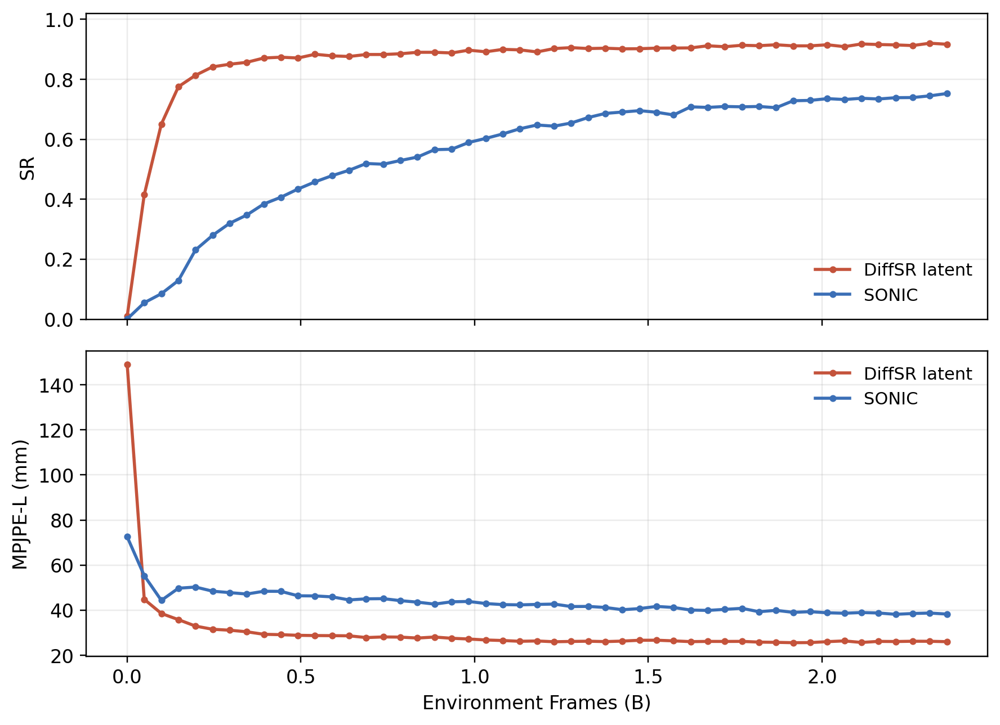

# BONES-129k SONIC comparison curve

This campaign records a one-GPU tracking-curve comparison between
SONIC and the DiffSR latent low-level policy on BONES-SEED.

## Question

Can the DiffSR latent tracker reach lower root-relative MPJPE and higher
success rate than SONIC when both are trained on the same BONES-SEED G1 reference
motions and evaluated on the same held-out 4,096-motion block?

## Data

Both training runs use the same BONES-SEED G1 motion set:

| method | training reference motions |
| --- | ---: |
| SONIC | 129,785 |
| DiffSR latent | 129,785 |

The shared evaluation set is the first 4,096 BONES-SEED ranks, using the same
ordered motion identities for both methods.

SONIC also reads its native matched SMPL representation. This is not an extra
robot motion dataset. It is the human-side representation used by SONIC's
universal-token training recipe. The same motion can be sampled through G1,
teleop-style, or SMPL-style command encoders.

## Protocol

Both curves use low-level RL environment frames on the x-axis.

| item | SONIC | DiffSR latent |
| --- | --- | --- |
| hardware | 1 x A40 | 1 x A40 |
| environments | 4,096 | 8,192 |
| rollout length | 24 | 24 |
| frames per training iteration | 98,304 | 196,608 |
| eval spacing | 49,152,000 frames | 49,152,000 frames |

SONIC was trained from a randomly initialized policy. DiffSR latent was trained
from a randomly initialized policy conditioned on a fixed pretrained root_qpos
DiffSR skill encoder.

## Evaluation

Evaluation uses the SONIC-compatible success criterion on the shared
4,096-motion block:

- success means the Reference finishes without a tracking failure;
- root/pelvis Z error threshold: 0.25 m;
- ankle and wrist Z error threshold: 0.25 m;
- root orientation error threshold: 1.0 rad;
- foot-position XYZ and base-height failures are disabled;
- interval push is disabled;
- policy action is deterministic.

The reported MPJPE-L is success-only. It is averaged only over completed
successful motions. This makes early low-SR MPJPE-L points less representative.

## Curve Points



| Frames (B) | SONIC SR | SONIC MPJPE-L (mm) | DiffSR latent SR | DiffSR latent MPJPE-L (mm) |
| ---: | ---: | ---: | ---: | ---: |
| 0.000 | 0.0007 | 72.56 | 0.0103 | 148.93 |
| 0.049 | 0.0549 | 55.31 | 0.4155 | 44.81 |
| 0.098 | 0.0850 | 44.35 | 0.6506 | 38.55 |
| 0.147 | 0.1292 | 49.75 | 0.7754 | 35.80 |
| 0.197 | 0.2310 | 50.27 | 0.8135 | 32.96 |
| 0.246 | 0.2795 | 48.44 | 0.8416 | 31.53 |
| 0.295 | 0.3198 | 47.80 | 0.8503 | 31.12 |
| 0.344 | 0.3474 | 47.17 | 0.8567 | 30.43 |
| 0.393 | 0.3843 | 48.40 | 0.8711 | 29.31 |
| 0.442 | 0.4067 | 48.36 | 0.8738 | 29.14 |
| 0.492 | 0.4341 | 46.39 | 0.8711 | 28.86 |
| 0.541 | 0.4580 | 46.33 | 0.8835 | 28.75 |
| 0.590 | 0.4788 | 45.91 | 0.8782 | 28.70 |
| 0.639 | 0.4968 | 44.56 | 0.8762 | 28.63 |
| 0.688 | 0.5193 | 45.04 | 0.8828 | 27.85 |
| 0.737 | 0.5168 | 45.12 | 0.8828 | 28.14 |
| 0.786 | 0.5293 | 44.23 | 0.8853 | 28.06 |
| 0.836 | 0.5408 | 43.57 | 0.8901 | 27.64 |
| 0.885 | 0.5654 | 42.70 | 0.8901 | 28.09 |
| 0.934 | 0.5669 | 43.73 | 0.8879 | 27.54 |
| 0.983 | 0.5894 | 43.87 | 0.8972 | 27.22 |
| 1.032 | 0.6030 | 42.95 | 0.8918 | 26.79 |
| 1.081 | 0.6179 | 42.48 | 0.8999 | 26.55 |
| 1.130 | 0.6353 | 42.36 | 0.8982 | 26.20 |
| 1.180 | 0.6477 | 42.56 | 0.8914 | 26.35 |
| 1.229 | 0.6438 | 42.71 | 0.9026 | 26.00 |
| 1.278 | 0.6543 | 41.62 | 0.9058 | 26.14 |
| 1.327 | 0.6726 | 41.67 | 0.9026 | 26.24 |
| 1.376 | 0.6863 | 41.21 | 0.9038 | 26.06 |
| 1.425 | 0.6909 | 40.20 | 0.9016 | 26.29 |
| 1.475 | 0.6956 | 40.72 | 0.9021 | 26.66 |
| 1.524 | 0.6902 | 41.67 | 0.9041 | 26.69 |
| 1.573 | 0.6812 | 41.22 | 0.9043 | 26.39 |
| 1.622 | 0.7083 | 40.06 | 0.9048 | 26.05 |
| 1.671 | 0.7063 | 39.91 | 0.9119 | 26.15 |
| 1.720 | 0.7095 | 40.36 | 0.9087 | 26.14 |
| 1.769 | 0.7083 | 40.82 | 0.9136 | 26.17 |
| 1.819 | 0.7095 | 39.32 | 0.9121 | 25.84 |
| 1.868 | 0.7053 | 39.94 | 0.9153 | 25.74 |
| 1.917 | 0.7285 | 39.04 | 0.9116 | 25.58 |
| 1.966 | 0.7297 | 39.35 | 0.9116 | 25.63 |
| 2.015 | 0.7356 | 38.85 | 0.9153 | 26.04 |
| 2.064 | 0.7327 | 38.65 | 0.9089 | 26.37 |
| 2.114 | 0.7368 | 38.96 | 0.9180 | 25.69 |
| 2.163 | 0.7344 | 38.76 | 0.9160 | 26.17 |
| 2.212 | 0.7388 | 38.17 | 0.9148 | 26.10 |
| 2.261 | 0.7393 | 38.53 | 0.9126 | 26.23 |
| 2.310 | 0.7449 | 38.73 | 0.9204 | 26.20 |
| 2.359 | 0.7527 | 38.28 | 0.9170 | 26.03 |

The curve shows DiffSR latent above SONIC in SR and below SONIC
in MPJPE-L through 2.359B frames. 

## Artifacts

Campaign artifacts:

```text
artifacts/sonic_latent_shared4096_curve.csv
artifacts/sonic_latent_shared4096_curve.png
plot_curve.sh
```

Plot script:

```bash
experiments/campaigns/2026-08-11-bones129k-sonic-latent/plot_curve.sh
```

## Interpretation Notes

- The comparison uses the same G1 Reference motion count and the same eval
  motion block.
- SONIC uses its native multi-representation recipe: G1, teleop-style, and
  SMPL-style command encoders.
