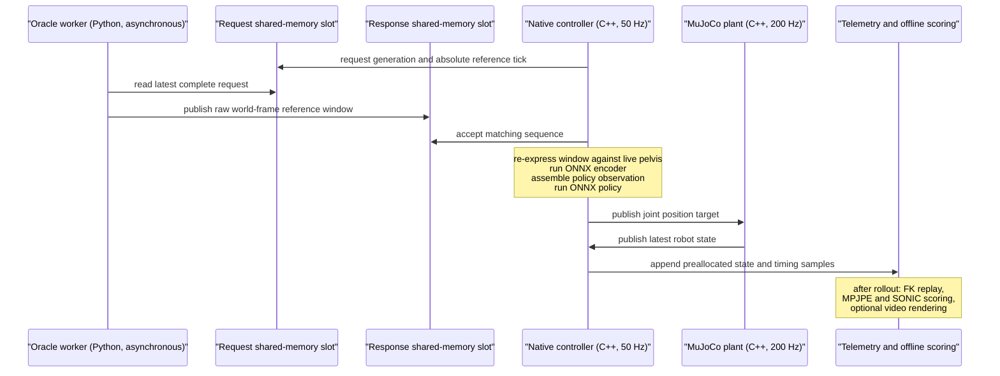

# Produce an EC reference-streaming oracle run

Status: runnable local procedure, verified 2026-08-11.

This page explains how to reproduce the Embodied-Control (EC)
reference-streaming oracle evaluation. The run uses the same asynchronous
command path, native encoder, native policy, and MuJoCo plant that a planner
uses. Only the command producer changes: expert reference data replaces the
VLA prediction.

The primary command below evaluates one or more complete motions. It starts
the robot on each reference frame-0 pose, runs the 50 Hz controller and 200 Hz
MuJoCo plant at wall-clock rate, computes MPJPE-L and MPJPE-G, applies the
released SONIC success thresholds after the full rollout, and can retain
native telemetry and videos.

This is a deployment rehearsal. It is not the paper's direct 50 Hz oracle
ceiling and it is not an Isaac Lab qualification result.

## 1. Terms and scope

The repository uses **oracle** for two related but different evaluations.

| Name | Command path | Purpose |
|---|---|---|
| direct 50 Hz oracle ceiling | fresh expert command goes directly to the frozen tracker on each control step | qualify the low-level policy in Isaac Lab |
| EC reference-streaming oracle | an asynchronous worker sends expert reference windows through the same encoder and command mailboxes used by deployment | test the native deployment runtime and measure its tracking |

This page describes the second row. Use
[`sonic-success-evaluation.md`](sonic-success-evaluation.md) for the Isaac Lab
SONIC-compatible evaluation. Do not compare a number from one row with a
number from the other row without stating the different simulator,
randomization, command cadence, and termination protocol.

The EC oracle is also not a planner result. Future reference frames are
allowed because the command producer is explicitly an oracle. A deployable
planner receives causal robot history and an explicit task input instead.

## 2. Executed system

The sweep runs one motion at a time. It uses a new pair of shared-memory slots
for each motion, so stale sequences from an earlier episode cannot enter the
next episode.



For a `root_qpos` bundle, one raw reference frame contains:

- 29 joint positions;
- 3 pelvis positions in the world frame;
- 4 pelvis quaternion values in XYZW order.

The native controller converts the selected frames to the bundle's declared
robot-relative encoder input. For the current z256 bundle, the encoder input
is ten 38-value frames at stride 1. The command hold is ten control ticks, but
the current EC oracle source re-encodes on each control tick. These are separate
settings: encoder window stride, command hold, encoder trigger, and policy
observation history must not be treated as one time parameter.

## 3. Known-good inputs

The commands in this page start in the top-level `IsaacLab-Imitation`
checkout. The current local inputs are:

```text
EC source:
  external/Embodied-Control

MuJoCo model:
  source/isaaclab_imitation/isaaclab_imitation/assets/unitree/
  g1_description/g1_29dof_rev_1_0.xml

Selected-ten reference tree:
  data/bones_seed_language10_v1/reference_arrays/root_qpos_v1

Released SONIC bundle:
  logs/policy_bundles/sonic_v1_1_native

Local z256 bundle:
  logs/policy_bundles/z256_scaled_5750m_v2
```

The selected-ten motion names, in manifest order, are:

```text
Neutral_stoop_down_001_A057
lift_crate_walk_ff_start_180_R_001_A140
drinking_standing_mug_R_001_A282
fishing_standing_loop_R_001_A500
cellphone_typing_sequence_one_hand_idle_R_001_A423
feeding_birds_start_R_001_A456
walk_arc_cw_start_R_slow_001_A443
mosquito_drive_away_R_001_A500
casual_greeting_R_001_A428
surrender_stop_R_001_A468
```

Do not select a policy by its directory name alone. A policy bundle is the
runtime contract. Its `manifest.json` must bind the checkpoint, encoder,
ordered observations and history, joint order, action scaling, gains, limits,
command semantics, model hashes, and parity result.

The released SONIC bundle has ten-frame proprioception histories and a
64-value FSQ command. The z256 bundle has a 258-value command: a 256-value
latent plus sine and cosine phase. They are different bundle instances run by
the same native controller.

## 4. Install and build the native environment

From the top-level repository root:

```bash
REPO_ROOT="$(pwd -P)"
EC_ROOT="${REPO_ROOT}/external/Embodied-Control"

cd "${EC_ROOT}"
pixi install --locked -e native
pixi run -e native build-native
pixi run -e native test-native
```

Run EC commands from `external/Embodied-Control`. The top-level Pixi manifest
does not define the EC `native` environment. A command run from the wrong
directory can select the wrong manifest and fail before it loads the bundle.

The build uses scikit-build-core and builds the `ec_native` C++ extension.
The native path includes ONNX Runtime, the 50 Hz controller, the 200 Hz MuJoCo
plant, shared-memory slots, observation assembly, action decode, and telemetry
buffers. Python controls lifecycle and offline analysis; it does not execute a
callback inside the control deadline.

## 5. Preflight the bundle and reference tree

Set explicit paths while still in `external/Embodied-Control`:

```bash
BUNDLE="${REPO_ROOT}/logs/policy_bundles/sonic_v1_1_native"
MODEL="${REPO_ROOT}/source/isaaclab_imitation/isaaclab_imitation/assets/unitree/g1_description/g1_29dof_rev_1_0.xml"
REFERENCE_ROOT="${REPO_ROOT}/data/bones_seed_language10_v1/reference_arrays/root_qpos_v1"

test -f "${BUNDLE}/manifest.json"
test -f "${BUNDLE}/policy.onnx"
test -f "${BUNDLE}/encoder.onnx"
test -f "${MODEL}"
test -f "${REFERENCE_ROOT}/reference_arrays_manifest.json"

pixi run -e native ec lowlevel verify-native-bundle "${BUNDLE}"
sha256sum "${BUNDLE}/manifest.json" "${BUNDLE}/policy.onnx" \
  "${BUNDLE}/encoder.onnx" \
  "${REFERENCE_ROOT}/reference_arrays_manifest.json" \
  "${MODEL}"
```

Retain the printed hashes with the run. The oracle worker also checks these
data contracts before it publishes a command:

- the reference format version is supported;
- the motion exists and the start frame is in range;
- the reference and bundle use the same ordered Isaac joint names;
- required joint velocities exist for an encoder interface that needs them;
- encoder interface, anchor mode, frame width, window length, and stride agree;
- the response horizon is long enough for the encoder window and hold;
- the reference manifest can be hashed.

The runtime rejects a disagreement. Do not repair a bundle manifest by hand to
make this preflight pass. Re-export the bundle from its checkpoint and resolved
training configuration.

## 6. Run the selected-ten sweep

Use a fresh output directory. The driver evaluates all motions in the
reference tree when `--motions` is omitted. The current reference tree is the
selected-ten tree, so this is the shortest canonical command.

```bash
RUN_ID="ec_oracle_sonic_selected10_seed0_clean_v1"
OUTPUT_ROOT="${REPO_ROOT}/logs/sonic_release_eval/${RUN_ID}"

test ! -e "${OUTPUT_ROOT}"

pixi run -e native python scripts/oracle_mpjpe_eval.py \
  --bundle "${BUNDLE}" \
  --model "${MODEL}" \
  --reference-root "${REFERENCE_ROOT}" \
  --output "${OUTPUT_ROOT}/sonic_eval.json" \
  --artifact-root "${OUTPUT_ROOT}/motions" \
  --cpu 2 \
  --physics-cpu 3
```

The driver prints one JSON row when each motion finishes. It then prints the
absolute report path and the aggregate. It deliberately runs at real-time
factor 1.0. Do not change it to an unpaced simulation when the purpose is to
test asynchronous command delivery and control timing.

The sweep performs these steps for each motion:

1. Load the motion and set `ticks = motion.length - 1`.
2. Create unique request and response shared-memory slots.
3. Start one asynchronous oracle worker and preload the selected motion.
4. Construct the native controller and independent MuJoCo plant.
5. Set the free-joint pose and all 29 joints from reference frame 0.
6. Start telemetry collection without a periodic Python callback.
7. Run every control tick at wall-clock pace.
8. Stop the worker and collect the fixed native telemetry arrays.
9. Replay robot kinematics with the same MuJoCo model.
10. Compute MPJPE-L, MPJPE-G, success, failures, and timing statistics.

Frame-0 initialization is part of the protocol. A default-pose start measures
initialization error instead of tracking. Reference alignment also uses the
absolute frame `accepted_reference_tick + window_slot`. Using the window slot
alone repeats frames 0 through 9 and gives invalid MPJPE-G.

### Retain telemetry and selected videos

Rendering happens after the paced rollout. It cannot change controller
timing. Add an artifact root and list only the motions that need videos:

```bash
RUN_ID="ec_oracle_sonic_selected10_video_seed0_clean_v1"
OUTPUT_ROOT="${REPO_ROOT}/logs/sonic_release_eval/${RUN_ID}"

test ! -e "${OUTPUT_ROOT}"

pixi run -e native python scripts/oracle_mpjpe_eval.py \
  --bundle "${BUNDLE}" \
  --model "${MODEL}" \
  --reference-root "${REFERENCE_ROOT}" \
  --output "${OUTPUT_ROOT}/sonic_eval.json" \
  --artifact-root "${OUTPUT_ROOT}/motions" \
  --video-motions \
    Neutral_stoop_down_001_A057 \
    lift_crate_walk_ff_start_180_R_001_A140 \
    drinking_standing_mug_R_001_A282 \
    walk_arc_cw_start_R_slow_001_A443 \
  --cpu 2 \
  --physics-cpu 3
```

Each video shows the reference on the left and the tracked policy on the
right. The script prints each retained absolute video path as `VIDEO: ...`.
This is required because remote execution does not transfer videos into the
local Codex application.

### Run the local z256 policy

Change only the bundle and use a distinct output root:

```bash
BUNDLE="${REPO_ROOT}/logs/policy_bundles/z256_scaled_5750m_v2"
RUN_ID="ec_oracle_z256_selected10_seed0_clean_v1"
OUTPUT_ROOT="${REPO_ROOT}/logs/deployment_eval/${RUN_ID}"

test ! -e "${OUTPUT_ROOT}"
pixi run -e native ec lowlevel verify-native-bundle "${BUNDLE}"

pixi run -e native python scripts/oracle_mpjpe_eval.py \
  --bundle "${BUNDLE}" \
  --model "${MODEL}" \
  --reference-root "${REFERENCE_ROOT}" \
  --output "${OUTPUT_ROOT}/sonic_eval.json" \
  --artifact-root "${OUTPUT_ROOT}/motions" \
  --cpu 2 \
  --physics-cpu 3
```

This substitution demonstrates the generic construction: SONIC and z256 are
not runtime types. The bundle supplies the encoder interface, observation
terms and history, action contract, and model stages.

### Run a subset

Use `--motions` when the reference tree contains more motions or when a fast
diagnosis is sufficient:

```bash
RUN_ID="ec_oracle_z256_failures_seed0_clean_v1"
OUTPUT_ROOT="${REPO_ROOT}/logs/deployment_eval/${RUN_ID}"

test ! -e "${OUTPUT_ROOT}"

pixi run -e native python scripts/oracle_mpjpe_eval.py \
  --bundle "${BUNDLE}" \
  --model "${MODEL}" \
  --reference-root "${REFERENCE_ROOT}" \
  --motions \
    fishing_standing_loop_R_001_A500 \
    feeding_birds_start_R_001_A456 \
  --output "${OUTPUT_ROOT}/sonic_eval.json" \
  --artifact-root "${OUTPUT_ROOT}/motions" \
  --video-motions \
    fishing_standing_loop_R_001_A500 \
    feeding_birds_start_R_001_A456 \
  --cpu 2 \
  --physics-cpu 3
```

The aggregate applies only to the selected subset. Its success rate must not
be labeled as selected-ten or full-dataset success.

## 7. What the report means

The main report is `sonic_eval.json`. Each motion row contains:

| Field | Meaning |
|---|---|
| `ticks` | requested complete rollout length |
| `frames` | aligned frames used for MPJPE |
| `no_fall` | base height stayed above 0.4 m for all recorded frames |
| `sonic_success` | complete motion with no released SONIC threshold failure |
| `failure_tick`, `failure_cause` | first offline threshold crossing |
| `mpjpe_l_mm` | mean root-relative tracked-body position error |
| `mpjpe_g_mm` | mean world-frame tracked-body position error |
| `mpjpe_*_p95` | 95th percentile of per-frame mean error |
| `encoder_inferences` | native encoder calls during the rollout |
| `tick_p99_ms` | control computation p99, excluding the independent plant |
| `deadline_misses` | command deadline misses |
| `scheduler_deadlines_missed` | 50 Hz scheduler misses |
| `fault` | native runtime fault code; zero means no fault |

MPJPE-G is the mean Euclidean position error of the tracked bodies in the
world frame. MPJPE-L subtracts the robot and reference root positions before
the same error calculation. MPJPE-L is position-relative; it does not rotate
points into the root orientation frame. Both metrics are in millimeters.

The aggregate uses frame-weighted micro-averaging. A long motion contributes
more frames than a short motion. `successful_mpjpe_l_mm_micro` includes only
motions that pass the SONIC criterion. `mpjpe_l_mm_micro` and
`mpjpe_g_mm_micro` include every full rollout, including post-failure and
post-fall frames.

The offline SONIC-compatible failure checks are:

- pelvis Z error greater than 0.25 m;
- pelvis orientation error greater than 1 rad;
- maximum ankle or wrist Z error greater than 0.25 m;
- incomplete reference coverage.

The scorer processes the complete rollout. It records the first threshold
crossing but does not terminate MuJoCo at that crossing. This design gives
full-horizon MPJPE and allows post-failure diagnosis.

## 8. Validate the output before reporting it

Use `jq` to inspect the protocol and aggregate:

```bash
jq '{protocol, aggregate}' "${OUTPUT_ROOT}/sonic_eval.json"

jq -e '
  .aggregate.motions == 10 and
  .aggregate.deadline_misses_total == 0 and
  .aggregate.scheduler_deadlines_missed_total == 0 and
  .aggregate.faults_total == 0 and
  ([.motions[] | (.frames == .ticks)] | all)
' "${OUTPUT_ROOT}/sonic_eval.json"
```

Also inspect every failure and timing tail:

```bash
jq -r '
  .motions[] |
  [.motion, .sonic_success, .failure_tick, .failure_cause,
   .mpjpe_l_mm, .mpjpe_g_mm, .tick_p99_ms] |
  @tsv
' "${OUTPUT_ROOT}/sonic_eval.json"
```

A valid report must have:

- the expected motion count and motion names;
- `frames == ticks` for every motion;
- no runtime fault;
- no command or scheduler deadline miss for the nominal rehearsal;
- one full result row for each requested motion;
- a fresh output root;
- retained bundle, reference manifest, model, and command provenance.

Do not report only success-only MPJPE. Report success or survival beside it.
A policy can obtain a low success-only error by failing its difficult motions.
Also report failure-inclusive full-horizon MPJPE when diagnosing robustness.

## 9. Current reproduced baselines

These are preliminary local deployment signals: one deterministic pass per
motion, no dynamics randomization, no observation corruption, and no repeated
seeds.

| Bundle | SONIC success | Success-only MPJPE-L | Full MPJPE-L | Full MPJPE-G |
|---|---:|---:|---:|---:|
| released `sonic_v1_1_native` | 10/10 | 17.89 mm | 17.89 mm | 49.34 mm |
| local `z256_scaled_5750m_v2` | 8/10 | 13.63 mm | 102.25 mm | 867.52 mm |

The z256 result is more precise on its eight successful motions and less
robust over the complete set. `fishing_standing_loop_R_001_A500` and
`feeding_birds_start_R_001_A456` fail the end-effector height check and later
fall. Do not use the lower success-only MPJPE to claim that z256 is better
overall.

The retained reports are:

- `logs/sonic_release_eval/ec_realtime_v1_1_selected10_seed0/sonic_eval.json`;
- `logs/deployment_eval/ec_realtime_z256_selected10_seed0/sonic_eval.json`.

## 10. Noise and randomization status

The current EC oracle run uses exact MuJoCo `qpos`, `qvel`, and root pose. It
does not apply sensor noise, observation corruption, dynamics randomization,
pushes, latency, quantization, or packet loss. The report records this as
`randomization: none (deterministic plant reset)`.

This clean pass is the regression baseline. When observation corruption is
implemented, retain it as a separate named profile. Apply the training-matched
noise to the current observation term before the value enters that term's
history ring. Do not corrupt the oracle reference, command packet, previous
action, or ground-truth metric stream.

A hardware sensor profile is a separate test. The policy must consume the
noisy or delayed sensed state, while MPJPE and success continue to use exact
MuJoCo truth. Record the profile name, resolved values, seed, and hash in the
run report. Never compare a clean single pass with a noisy repeated-seed run
as if they used one protocol.

## 11. Manual two-terminal run for diagnosis

The sweep driver is the normal path. Use the manual form only when you must
inspect worker and controller reports separately.

Start both terminals in the top-level repository root. Run this common setup
in both terminals:

```bash
REPO_ROOT="$(git rev-parse --show-toplevel)"
EC_ROOT="${REPO_ROOT}/external/Embodied-Control"
BUNDLE="${REPO_ROOT}/logs/policy_bundles/sonic_v1_1_native"
MODEL="${REPO_ROOT}/source/isaaclab_imitation/isaaclab_imitation/assets/unitree/g1_description/g1_29dof_rev_1_0.xml"
REFERENCE_ROOT="${REPO_ROOT}/data/bones_seed_language10_v1/reference_arrays/root_qpos_v1"
MOTION="walk_arc_cw_start_R_slow_001_A443"
REQUEST_SLOT="/ec_g1_oracle_debug_request"
RESPONSE_SLOT="/ec_g1_oracle_debug_response"
DEBUG_ROOT="${REPO_ROOT}/logs/deployment_eval/ec_oracle_debug"

cd "${EC_ROOT}"
```

Terminal 1 owns the shared-memory slots:

```bash
pixi run -e native ec lowlevel oracle-worker "${BUNDLE}" \
  --reference-root "${REFERENCE_ROOT}" \
  --motion "${MOTION}" \
  --start-frame 0 \
  --request-slot "${REQUEST_SLOT}" \
  --response-slot "${RESPONSE_SLOT}" \
  --create-slots \
  --report "${DEBUG_ROOT}/oracle_worker.json"
```

Terminal 2 connects to the existing slots:

```bash
pixi run -e native ec lowlevel mujoco-native "${BUNDLE}" \
  --model "${MODEL}" \
  --command-source oracle \
  --request-slot "${REQUEST_SLOT}" \
  --response-slot "${RESPONSE_SLOT}" \
  --connect-slots \
  --ticks 500 \
  --lead-ticks 4 \
  --cpu 2 \
  --physics-cpu 3 \
  --mpjpe \
  --reference-root "${REFERENCE_ROOT}" \
  --motion "${MOTION}" \
  --telemetry-dir "${DEBUG_ROOT}/telemetry" \
  --telemetry-hz 1 \
  --report "${DEBUG_ROOT}/controller.json"
```

Set `--ticks` to `motion.length - 1` for a complete result. A fixed value of
500 is only a debugging example and can truncate a longer motion. The sweep
driver derives the correct value automatically and is safer for metrics.

Start the owner first. If the controller creates a second slot pair, the two
processes do not communicate. Stop both processes before reusing fixed debug
slot names after an abnormal exit. The sweep avoids this problem by using
unique names.

## 12. Common failures

### The `native` Pixi environment does not exist

The command probably ran from the top-level repository. Change directory to
`external/Embodied-Control` and retry.

### The worker reports an encoder contract disagreement

The bundle and reference tree do not have the same encoder state interface,
anchor mode, frame width, or stride. Use the reference tree that belongs to
the checkpoint, or export a correct bundle. Do not disable the check.

### The worker reports a joint-order disagreement

The reference manifest and bundle list different Isaac joint orders. This is
a data-contract failure. Rebuild the reference arrays or bundle from the
correct source configuration.

### MPJPE-G is extremely large from the first frame

Confirm that the controller was initialized with the reference frame-0 root
pose and joints. Then confirm that telemetry records absolute reference
frames rather than window slots. An orientation or quaternion-order defect can
also cause this symptom: reference and runtime boundaries use XYZW, while
MuJoCo free-joint `qpos` uses WXYZ.

### A short motion fails near its end

The oracle worker repeats the last frame to pad the encoder window. This is
expected. Check `valid_frames`, the requested absolute tick, and whether the
controller ran beyond `motion.length - 1`.

### The first command is late

The controller must not wait for the producer. It can remain in WAIT while the
first valid packet arrives. Persistent absence, a stale packet, a wrong
generation, a wrong sequence, a wrong width, or non-finite data must lead to a
reported fault or DAMP behavior, not an unbounded block.

### Timing is worse while rendering

The normal driver renders only after the paced rollout. If timing changes,
confirm that no other render, test suite, model export, or heavy process ran on
the same host during the measurement. Do not certify a real-time run under
uncontrolled concurrent load.

### The robot falls in MuJoCo but not Isaac Lab

Treat this first as a sim2sim signal. Record MuJoCo integration, actuator
gains, action scale, effort and joint limits, armature, damping, friction, and
the exact initial pose. Do not tune the policy or success thresholds until the
action and actuator contracts are proven equal.

## 13. Minimum retained evidence

For a result that another person can reproduce, retain:

- `sonic_eval.json`;
- exact command and working directory;
- bundle path and `manifest.json` hash;
- policy and encoder ONNX hashes;
- source checkpoint and encoder hashes from the bundle manifest;
- reference root and reference manifest hash;
- MuJoCo model hash;
- EC and top-level repository commits, including dirty-state notice;
- CPU placement and real-time scheduling options;
- observation corruption and sensor profile names, or explicit `none`;
- randomization and seed information;
- per-motion telemetry for failures;
- at least one non-terminating diagnostic video;
- output validation result.

The current sweep report does not yet embed every item in this list. Until the
artifact schema is extended, save the command, `git status --short`, commit
IDs, and `sha256sum` output beside the JSON. A future run manifest should make
these fields mandatory and refuse an existing output root.

## 14. Claim limits

A selected-ten, single-pass EC run can prove that the native construction
works on those motions and can expose timing or sim2sim failures. It cannot
prove hardware readiness, full-dataset robustness, or a paper-level policy
comparison.

Before a stronger claim:

1. Add the exact training-matched observation corruption profile.
2. Run the same motion set with at least three independent noise seeds.
3. Keep clean and noisy results in different output roots.
4. Calibrate a separate sensor profile from G1 hardware logs.
5. Run strict Isaac oracle qualification and the full-horizon diagnostic.
6. Run target-host timing, watchdog, and DAMP drills before enabling hardware
   writes.

The stable interpretation is: the oracle producer proves the command and
encoder path with known reference input. It does not remove the need to test
the planner, sensor path, plant model, and hardware safety state machine.
