# Tracker runtime: low-level inference pipeline design

> **Superseded as the architecture reference (2026-08-11):** the revised
> asynchronous stage/mailbox architecture lives in
> [`tracker-runtime-v2-architecture.md`](tracker-runtime-v2-architecture.md).
> This page remains the historical log: contracts as first specified,
> milestone chronology, run results, and incident notes.

Status: native inference implementation and generic-runtime construction plan,
2026-08-11, revision 9. Revision 2 made the
command buffer the central seam (VLA -> buffer -> tracker -> eval env), the
VLA command interface-agnostic (explicit, latent, or chunk over one
envelope), and added a C++/pybind11 native tier for hardware communication.
Revision 3 built the M0 prototype. Revision 4, per user direction on
2026-08-10/11: **the reference bundles are `z256_scaled` and `fsq64_scaled`
stride-1 — not the L2T student** (its bundle proved the mechanics only);
FSQ bundles carry the lattice in the manifest and the tracker quantizes at
consume time (SONIC convention: a planner regresses the PRE-quantized
bounded vector); and the native tier's first module (shm command buffer) is
BUILT on the scikit-build-core pattern from `~/Documents/SL/rcd`. This is a
prototype by explicit decision: revise freely, do not treat current APIs as
frozen. Revision 5 moves the complete 50 Hz control hot path to C++ with
ONNX Runtime: observation assembly, encoder and policy inference, action
decode, scheduler, planner mailboxes, and fake/MuJoCo stepping. Python now
does startup, configuration, and diagnostics. The optional Unitree SDK2
build also owns low-state receive and the independent 500 Hz writer in C++.
It is compile- and dry-run-qualified only; no robot command was sent.
Revision 6 separates MuJoCo from the controller: an independent absolute
200 Hz native thread owns all physics and servo work, while the 50 Hz
controller exchanges bounded state and target snapshots with it. Revision 7
adds a hash-gated reference-streaming latent source for oracle evaluation and
fixes the native projected-gravity convention to match Isaac Lab. Revision 8
corrects the construction boundary: SONIC, DiffSR, FSQ, explicit, and chunk
trackers are bundle instances, not runtime policy families. The native mirror
of Isaac Lab's fixed `actor` command term is the only object that connects a
command buffer to policy observations. A controller-owned C++ command buffer
sits between an asynchronous planner or oracle worker and the synchronous
50 Hz policy. Planner RTC, forecast history, and temporal aggregation stay on
the planner side and publish only their final command packet. The current
`ec.bundle/v1` and fixed native command tags are prototype code to replace;
the `ec.bundle/v2` plan below is the construction target.

Revision 9 implements the first generic history-aware observation contract.
Every new bundle observation term records its sample width, history length,
history stride, history order, reset fill, and normalization. Older v1 bundles
that omit these fields load with history length and stride one for backward
compatibility; re-export them before a release so the fields are explicit. The
C++ runtime compiles the ordered terms into fixed rings and a preallocated
term-major policy input. The Python path is the parity specification. This
makes the SONIC release actor an ordinary bundle instance: its five
proprioception terms
use ten-frame oldest-first histories, while its latent command has history one.
It also separates command hold, encoder reference stride, encoder trigger, and
low-level observation history. Planner temporal aggregation remains outside
the low-level runtime.

The first SONIC bundle is
`logs/policy_bundles/sonic_v1_1_native`. It binds checkpoint SHA-256
`af24831ae59424a0cf92cb56e9bb6dc1a59ab859fd055ba13187e9e6f0a59f43`.
ONNX Runtime parity is 0.0 maximum absolute error for the encoder and
3.34e-6 for the policy. A preliminary, deterministic EC real-time rehearsal
over the selected ten motions completed 10/10 motions under the offline SONIC
thresholds. Success-only MPJPE-L is 17.89 mm over 5,137 frames, with a
per-motion range of 9.87-22.98 mm. There were zero command deadline misses,
zero scheduler deadline misses, and zero runtime faults. Per-motion control
p99 was 3.73-5.37 ms. This is one pass with deterministic MuJoCo reset and no
randomization; it is not the randomized Isaac paper protocol. The retained
report is
`logs/sonic_release_eval/ec_realtime_v1_1_selected10_seed0/sonic_eval.json`.

The matched local `z256_scaled` bundle at 5.75B frames uses the same ten
motions, frame-0 poses, deterministic plant, full horizons, and offline SONIC
success scorer. It succeeds on 8/10 motions. Its success-only MPJPE-L is
13.63 mm; thus it is more precise on its success set than SONIC, but less
robust. `fishing_standing` first fails the end-effector height threshold at
tick 233, and `feeding_birds` first fails it at tick 499; both motions later
fall. It also has zero command deadline misses, zero scheduler deadline
misses, and zero runtime faults. This matched one-pass result is preliminary
for the same reason as the SONIC result. The retained report is
`logs/deployment_eval/ec_realtime_z256_selected10_seed0/sonic_eval.json`.

Four SONIC full-horizon diagnostics also retain native telemetry and
reference-left / policy-right videos: neutral stoop, lift-crate-and-walk,
standing mug drinking, and curved walking. The runtime completes and measures
each asynchronous rollout before off-path replay renders the video, so
rendering cannot change control timing. All four pass the offline SONIC
thresholds. The report and per-motion artifacts are under
`logs/sonic_release_eval/ec_realtime_v1_1_diagnostic4_seed0/`.

The runtime code lives in `external/Embodied-Control`
(github.com/fei-yang-wu/Embodied-Control, our repo), package
`embodied_control.lowlevel`. The exporter lives in
`source/imitation_experiments/imitation_experiments/lowlevel/`.

Companion pages: [`gr00t-planner-deployment.md`](gr00t-planner-deployment.md)
(the 5 Hz planner service; it is one VLA publisher for this runtime),
[`sonic-release-checkpoint-tier2.md`](sonic-release-checkpoint-tier2.md)
(the released SONIC checkpoint), and `wiki/current-status.md`.

## Definitions

Plain-language definitions first. These terms are used through this page.

- **Tracker runtime**: the Embodied-Control subsystem that runs a trained
  50 Hz low-level policy (the tracker) outside Isaac Lab.
- **Policy bundle**: a self-describing directory that carries one exported
  tracker: model stages, ordered observation contract, actor-command output
  contract, action contract, and provenance hashes. The bundle is the only
  interface between training code and the runtime.
- **Actor channel**: the single command the low-level policy consumes. This
  is the same term used by the Isaac Lab command interface. It can serve one
  or more named components, but the actor receives exactly one channel.
- **Actor command term**: the fixed `actor` term that receives final command
  packets, owns their consumption state, and serves `component(name)` to the
  observation assembler. It mirrors the Isaac Lab `CommandTerm`; it is not a
  SONIC, latent, or explicit policy class.
- **Command packet**: one final command publication. The v2 envelope carries a
  schema identifier, sequence, episode generation, source and intended
  execution ticks, receive stamp, valid length, and a fixed float32 payload.
  The current v1 `explicit | latent | chunk` tag is prototype state, not the
  target dispatch mechanism.
- **Command buffer**: the controller-owned C++ shared-memory seqlock between a
  command producer and the actor command term. `publish()` writes one complete
  packet; `snapshot()` reads the latest complete packet without waiting. The
  low-level runtime owns its allocation and lifetime. A planner, oracle, or
  later teleoperation process receives only a producer handle.
- **Planner worker**: the asynchronous producer around the VLA. It owns model
  inference, RTC, forecast history, optional temporal aggregation, and any
  reduction from prediction horizon to execution horizon. It publishes only
  the final packet accepted by the actor command term.
- **Eval-env backend**: the component that consumes joint commands and
  produces robot state. Sim (MuJoCo) and real (Unitree DDS) implement the
  same protocol (`RobotBackend` in code); the tracker cannot tell them
  apart.
- **Engine**: the component that executes a neural forward pass
  (`obs -> action` or `macro window -> z`). C++ ONNX Runtime is the
  production low-latency engine. Torch remains the audit reference.
- **Native tier**: the scikit-build-core C++/pybind11 package (`ec_native`).
  It owns each deadline-sensitive loop. Python twins remain for tests and
  portable diagnostics, but they are not the hardware execution path.
- **Golden trace**: a recorded sequence of (observation, action) pairs from
  a reference implementation. The runtime must reproduce it within
  tolerance.

## Component map and workflows

Four diagrams anchor the terminology before the detailed spec. Every box
name below is a term from the Definitions section or a module in the code.

### Who does what

Training code and the runtime never import each other. The exporter runs
once per checkpoint and writes a policy bundle. The bundle is generated from
the resolved Isaac Lab `CommandManager` and observation configuration. The
runtime does not dispatch on policy names or on `SONIC`, `latent`, or
`explicit` labels.

```mermaid
flowchart LR
    subgraph TRAIN["IsaacLab-Imitation — training side"]
        CONFIG["resolved Isaac Lab config<br/>actor command term + observations"]
        CKPT["tracker checkpoint"]
        EXPORTER["bundle exporter<br/>models + compiled data contracts<br/>parity and provenance gates"]
        CONFIG --> EXPORTER
        CKPT --> EXPORTER
    end

    EXPORTER -->|"writes once; hashes all files"| BUNDLE["ec.bundle/v2<br/>model stages + actor command contract<br/>+ observation plan + action contract"]

    subgraph PRODUCERS["asynchronous command producers"]
        PLANNER["planner worker<br/>VLA inference + RTC + forecast history<br/>+ optional temporal aggregation"]
        ORACLE["oracle worker<br/>reference-data stream"]
    end

    subgraph RUNTIME["native low-level runtime"]
        REQUEST["C++ state-request slot<br/>pull topology only"]
        BUFFER["controller-owned C++ command buffer<br/>latest complete packet; never blocks"]
        ACTOR["native actor command term<br/>validate + hold/phase/slot + live frame<br/>+ optional declared encoder/quantizer"]
        OBS["compiled observation plan<br/>robot + actor components + last action"]
        POLICY["50 Hz ONNX policy"]
        LOOP["native control loop<br/>scheduler + action decode + safety"]
    end

    subgraph ENVS["eval-env backends"]
        FAKE["fake<br/>tests"]
        MUJOCO["MuJoCo<br/>sim2sim"]
        DDS["Unitree DDS<br/>optional native build"]
    end

    REQUEST -->|"causal state request"| PLANNER
    PLANNER -->|"final actor-ready or declared intermediate packet"| BUFFER
    ORACLE -->|"same packet envelope"| BUFFER
    BUFFER --> ACTOR --> OBS --> POLICY --> LOOP
    LOOP -->|"bounded state snapshot"| REQUEST
    BUNDLE -.->|"compile once at start"| ACTOR
    BUNDLE -.->|"compile once at start"| OBS
    BUNDLE -.->|"load once at start"| POLICY
    LOOP <-->|"robot state / joint targets"| ENVS
```



### Example data shapes: one latent z256 bundle

This diagram describes one bundle instance. It does not define the runtime
architecture. A SONIC bundle, an explicit-command bundle, or another latent
bundle supplies a different actor-command and observation description while
using the same native objects.

```mermaid
flowchart LR
    REF["reference arrays<br/>per frame: qpos 29 +<br/>anchor pose (pelvis, world)"] --> WIN
    GROOT2["GR00T head<br/>in: causal history 10x93<br/>+ language features<br/>out: chunk 30x38"] -.->|"window slice"| WIN
    WIN["macro window<br/>10 frames x 38<br/>= qpos 29 + anchor_pos_b 3<br/>+ anchor_ori_b rot6d 6<br/>(robot-anchored)"] --> ENC["DiffSR encoder<br/>380 in"]
    ENC --> Z["z 256"]
    Z --> CMD["latent_command 258<br/>= z ++ sin/cos phase<br/>renewed every hold=10 ticks"]
    CMD --> OBS["actor obs 351<br/>+ joint_pos_rel 29<br/>+ joint_vel_rel 29<br/>+ base_ang_vel 3<br/>+ projected_gravity 3<br/>+ last_action 29"]
    OBS --> NORM["normalizer<br/>mask exempts the latent slice"]
    NORM --> MLP["policy MLP<br/>2048-2048-1024-1024-512-512"]
    MLP --> ACT["raw action 29<br/>(also next tick's last_action)"]
    ACT --> QT["q_target 29<br/>default_joint_pos + scale x action"]
    QT --> PD["PD servo kp/kd<br/>4 substeps @ 200 Hz"]
```



The FSQ variant: z is 64 lattice values (multiples of 1/16), the command is
66 wide, the obs 159, and the tracker snaps incoming z onto the lattice
before assembly (a planner regresses the pre-quantized vector).

### One control tick (50 Hz)

```mermaid
sequenceDiagram
    participant Env as eval-env backend
    participant Loop as control loop
    participant Buf as command buffer
    participant Cmd as actor command term
    participant Obs as observation plan
    participant Eng as engine

    Loop->>Env: read_state()
    Env-->>Loop: RobotState (joints, gravity, ang vel, anchor pose)
    Loop->>Buf: snapshot() [latest complete packet; never blocks]
    Buf-->>Loop: packet or unavailable
    Loop->>Cmd: update(tick, state, packet)
    Note over Cmd: validate generation and schema;<br/>apply declared hold/phase/slot and live-frame rules
    Loop->>Obs: assemble(state, actor command components, last action)
    Obs-->>Loop: flat observation in bundle order
    Loop->>Eng: infer(observation)
    Eng-->>Loop: raw action
    Note over Loop: decode and limit joint target
    Loop->>Env: publish latest q_target  [bounded snapshot]
    Note over Env: independent 200 Hz thread:<br/>read latest target, apply servo, mj_step,<br/>publish latest state
    Note over Loop: watchdogs: stale command -> hold+count,<br/>absent state / NaN -> DAMP (kp=0, kd=8)
```

### Async pull topology (example: hold 10 / lead 4)

The control tick never waits for the planner. The worker thread requests a
chunk `lead` ticks before the hold expires; inference overlaps the stale
command's last ticks; the swap lands exactly at expiry.

```mermaid
sequenceDiagram
    participant Loop as control loop (50 Hz)
    participant Req as C++ state-request slot
    participant Planner as asynchronous planner worker
    participant Buf as C++ command buffer
    participant Cmd as actor command term

    Note over Loop,Cmd: ticks 0..5: execute the accepted command
    Loop->>Req: tick 6: publish causal state request
    Req-->>Planner: nonblocking request snapshot
    activate Planner
    Note over Planner: VLA forward + RTC if enabled<br/>+ forecast history + temporal aggregation if enabled<br/>+ reduce prediction horizon to the publication payload
    Note over Loop,Cmd: ticks 6..9: continue the old command; never wait
    Planner->>Buf: publish final packet with request sequence and generation
    deactivate Planner
    Loop->>Buf: tick 10: snapshot response
    Buf-->>Loop: latest complete packet
    Loop->>Cmd: accept at renewal boundary
    Note over Loop,Cmd: deadline miss: hold the last valid command,<br/>restart or advance only as declared, and count the miss
```

## Goals

1. Borrow the scheduling and safety shape of SONIC's
   `gear_sonic_deploy` low-latency pipeline
   (NVlabs/GR00T-WholeBodyControl, pinned `aa263a8a`), but make it
   installable with one `pixi install` and configurable without editing
   source or rebuilding.
2. Reproduce the simulation boundary: one fixed manager-style `actor`
   command term connects command producers to policy observations. The term
   has `reset`, `due`, `publish`/`accept`, `update`, and `component`
   behavior. Renewal is per episode generation, never global tick modulo.
3. Make policy variation data-driven. Each bundle describes observation
   sources, actor-command components and execution semantics, optional
   model stages, and action decode. Adding SONIC or another trained policy
   requires an exporter or bundle adapter, not a native runtime branch.
4. Put the controller-owned C++ command buffer between asynchronous
   producers and the synchronous 50 Hz policy. The low-level thread only
   takes a bounded snapshot. It never calls or waits for a planner.
5. Keep all deadline-sensitive work in C++: static buffers, no Python
   callback on a tick, ONNX Runtime sessions created once, and separate
   50 Hz control, 200 Hz MuJoCo physics, and 500 Hz DDS schedules. Python
   only configures, starts, stops, and reads diagnostics.
6. Keep the construction simple: one native package, one manifest contract,
   one actor command term, one observation plan, one backend interface, and
   a command buffer plus an optional state-request slot.

Non-goals: retraining, reward or termination logic, planner training, and
any change to the frozen paper protocol. Temporal aggregation is also not a
low-level feature. It is a planner option and is recorded with planner
configuration and planner artifacts. The runtime evaluates and deploys; it
never defines a paper number (Isaac evaluation remains the protocol surface).

## What we take from SONIC deploy, and what we replace

Upstream facts, from the pinned checkout (paths under `gear_sonic_deploy/`):

- Four recurrent real-time threads: Input 100 Hz, Control 50 Hz, Planner
  10 Hz, DDS command writer 500 Hz
  (`src/g1/g1_deploy_onnx_ref/src/g1_deploy_onnx_ref.cpp:14-21`), with
  `SCHED_FIFO` and CPU affinity (`:2600-2606`).
- Control tick: gather state -> gather input -> assemble observations ->
  encoder -> policy -> motor command -> publish (`:3783-3800`).
- `PolicyEngine`/`EncoderEngine`: ONNX converted to TensorRT once and cached
  on disk, FP16 option, pinned-memory I/O, optional CUDA graph capture
  (`include/control_policy.hpp`, `include/encoder.hpp`).
- YAML observation registry: named terms with enable flags; encoder modes
  zero-fill unused inputs (`include/observation_config.hpp`,
  `policy/release/observation_config*.yaml`).
- Safety: state machine INIT -> WAIT_FOR_CONTROL -> CONTROL, ramp to default
  pose, freshness watchdogs (low state late > 50 ms, absent > 500 ms,
  streamed data absent > 150 ms, token timeout 200 ms), temperature
  monitoring, damping stop (kp=0, kd=8, `:2715-2716`).
- Action decode: `q_target = default_angles + action[perm] * scale`, fixed
  per-joint kp/kd, tau_ff = 0 (`:3104-3133`), with an explicit
  IsaacLab-to-hardware joint permutation.
- External command stream: tokens arrive over ZMQ at 5 Hz minimum into a
  buffer owned by the controller; missing tokens are zero-filled with a
  warning (`:3826-3833`).

| SONIC element | We keep | We replace | Why |
| --- | --- | --- | --- |
| Rate-decoupled loops, per-rate threads | shape and rates | C++ for the complete control hot path; Python only at lifecycle boundaries | this removes GIL, allocation, and callback tail latency from both 50 Hz and 500 Hz loops |
| Controller-owned token buffer fed over ZMQ | the buffer-centric shape, generalized to both ownership sides | zero-fill of missing commands with hold-last + miss counter | "never block, never fabricate" (planner deployment page) |
| TensorRT + CUDA graphs + FP16 | as a later GPU tier | CPU ONNX Runtime first, with fixed thread count and static batch one | the tracker is small; measured CPU latency already has large 20 ms headroom |
| YAML obs registry + rebuild per checkpoint | named-term registry idea | contract read from the bundle; no hand-edited obs YAML, no rebuild | upstream requires editing `GetObservationRegistry()` and recompiling for a new obs set |
| State machine + watchdogs + damping stop | all of it, same defaults | — | proven safety shape |
| Vendored unitree_sdk2, ROS2 scripts, deb packages | unitree_sdk2 C++, vendored and pinned, but inside the `ec_native` pybind module | ROS2 entirely; deb side-loads | install burden is the main complaint with upstream |
| ONNX export contract (`obs_dict -> action`) | single static input/output and opset 18 | strict manifest shapes, names, hashes, and CPU replay tolerance | C++ can reject a wrong model before starting a loop |
| Reference motion playback + heading re-init | the concept | our NPZ reference contract and anchor math | conventions differ (joint order, quats, anchors) |

## Design philosophy

1. **The bundle is the contract.** The env configuration is the input-key
   authority (`command_interface.py:499-506`; keys are derived, never
   restated). The exporter serializes that authority into the bundle. The
   runtime interprets the bundle and hardcodes nothing about any specific
   policy. A new policy configuration means a new bundle, never a runtime
   edit.
2. **The actor command term is the only policy-facing command seam.** It is
   the native mirror of the resolved Isaac Lab `actor` command term. The
   observation plan asks it for named components. The observation plan does
   not know which producer made the command.
3. **The controller-owned C++ command buffer is the only asynchronous
   seam.** The tracker never calls a VLA and never waits for one on a control
   tick. It takes a bounded snapshot of the latest complete packet. Remote
   planner, oracle, scripted, and later teleoperation producers receive a
   producer handle to the same buffer type.
4. **Producer transformations stay with the producer.** Planner inference,
   RTC, forecast history, temporal aggregation, and prediction-horizon
   reduction belong to the planner worker. The actor command term owns only
   low-level consumption semantics: validation, per-generation renewal,
   hold/phase/slot state, live-frame re-expression, and optional declared
   encoder or quantizer stages.
5. **Configuration chooses sources, topologies, and rates — never the
   contract.** A job YAML selects the eval-env backend, the command
   topology, and safety limits. It cannot reorder observation terms, change
   widths, or toggle normalization. Those are facts about the checkpoint and
   live in the bundle.
6. **ONNX-native for deployment; Torch for reference.** The exporter first
   proves eager, TorchScript, RLOpt-native, and CPU ONNX parity. Deployment
   loads only the ONNX artifacts and their exact manifest contract. A later
   TensorRT engine must stay behind the same static interface.
7. **Python orchestrates; C++ owns deadlines.** The pybind11 boundary is
   outside the tick loop. C++ creates and joins the scheduler, planner
   mailbox, encoder, policy, simulator, DDS receive, and DDS writer work.
   Python never supplies a per-tick callback.
8. **Rate-decoupled loops with explicit staleness.** Control runs at 50 Hz.
   Publishers renew on their own schedule. Every consumer knows the age and
   sequence of what it consumes. A stale input is held and counted, never
   fabricated, and trips a watchdog past a threshold.
9. **Fail loud, damp safe.** Config and contract violations fail at load
   time (pydantic validators), before any process starts. Runtime faults
   (NaN, absent state, engine failure) transition to DAMP, then write the
   full artifact contract. A run directory always contains `status.json`.
10. **Prove with something cheap before something real.** Fake env before
   MuJoCo before hardware; synthetic parity before Isaac golden traces
   before closed loop. This is the Embodied-Control house rule and it stays.
11. **Provenance gates carry over.** Checkpoint SHA-256, ordered input keys,
   encoder binding, macro stride, and anchor mode are recorded at export and
   re-verified at load. A silent-mismatch class of bug (stride, anchor mode,
   window mode — width-invisible) must be caught by recorded metadata, not
   by shape checks (`hl_skill_diffsr.py:856-911` is the in-env precedent).
12. **One artifact contract.** Every run writes the Embodied-Control
    artifact set: `job.yaml`, `resolved_job.yaml`, `manifest.json`,
    `status.json`, `metrics.json`, `episodes.jsonl`, `logs/`, optional
    `videos/`.

## Ownership split

- `imitation_experiments.lowlevel.export_policy_bundle` (this repo):
  reads an RLOpt checkpoint, rebuilds standalone modules, derives the
  observation contract from the task id plus overrides via
  `bind_command_interface` (`command_interface.py:519-552`), validates
  encoder binding, writes the bundle. Runs in the isolated `onnx-export`
  Pixi environment; it reads stdlib-only task contracts and the packaged
  G1 MJCF. Structural templates
  already exist: `_mlp_from_state_dict`
  (`lowlevel/sonic_release_actor.py:144-172`) and the 27-line standalone
  `SkillEncoder` (`capacity/measure_encoder_noise_contraction.py:71-97`).
- `embodied_control.lowlevel` (Embodied-Control): everything else. Zero
  imports of Isaac Lab, RLOpt, torchrl, or tensordict. The `lowlevel` Pixi
  feature stays available for reference execution. The `native` feature
  builds `ec_native`, MuJoCo, and the C++ ONNX Runtime engine. Unitree SDK2
  is optional at build time. The light default env keeps importing the
  package.

Why this split: the exporter needs the training stack once, at export time.
The runtime must run on machines that will never install Isaac Sim (robot
onboard PC, a laptop, a CI runner). The bundle is the only thing that
crosses the boundary, in one direction.

## The policy bundle

The existing `ec.bundle/v1` layout below records the implemented prototype.
It is useful for measurements, but it hardcodes an `interface` enum and
policy-specific command fields. Construction continues with
`ec.bundle/v2`; v1 stays only as a migration input and regression fixture.

### Construction target: `ec.bundle/v2`

```text
bundle/
  manifest.json                 # api_version "ec.bundle/v2"
  models/
    policy.onnx                 # required 50 Hz stage
    command_encoder.onnx        # optional command-acceptance stage
  observation_plan.json         # ordered, compiled term description
  actor_command_contract.json   # packet and output-component semantics
  action_contract.json          # joint order, decode, limits, gains
  golden_observation_trace.npz  # manager -> exported plan parity
  golden_command_trace.npz      # manager term -> native term parity
  golden_action_trace.npz       # ONNX action parity
```

Required v2 manifest sections:

- `source`: checkpoint, resolved task and overrides, source revisions,
  exact export command, and SHA-256 values.
- `actor_command`: ingress schema identifiers; fixed payload limits; output
  component identifiers, widths, units, and frames; reset and episode-
  generation behavior; hold, phase, slot, and renewal semantics; and optional
  command-acceptance model or quantizer stages. Terms such as `SONIC`,
  `DiffSR`, `explicit`, and `latent` can appear in provenance or a human
  description. They are not runtime dispatch keys.
- `observation`: an ordered list of terms. Each term gives its source
  (`robot`, `actor`, or `last_action`), component identifier, gather or
  transform operation, width, history length, history stride, flatten order,
  reset-fill rule, and destination offset.
- `models`: named ONNX stages with static input/output descriptors and one
  trigger: `every_control_tick` or `on_command_acceptance`.
- `action`, `rates`, and `files`: the existing decode, schedule, and hash
  contracts with static sizes and no unresolved defaults.

The low-level bundle does **not** contain temporal-aggregation settings,
forecast history, RTC weights, or planner horizon policy. Those belong to a
planner artifact. The only planner result in the low-level contract is a
final packet that matches a declared ingress schema.

At startup, the loader validates v2 and compiles strings and variable-length
JSON into numeric identifiers, fixed offsets, and preallocated buffers. The
50 Hz path does no JSON lookup, string lookup, heap allocation, or Python
callback.

### Implemented prototype: `ec.bundle/v1`

```text
bundle/
  manifest.json        # api_version "ec.bundle/v1", provenance, interface,
                       # dims, encoder provenance, export command, hashes
  policy.pt            # TorchScript: normalizer + MLP, deterministic forward
  policy.onnx          # required by native deployment, static [1, obs] -> [1, 29]
  obs_contract.json    # ordered terms, widths, normalize spans
  action_contract.json # joint order, defaults, scales, actuation params
  encoder.pt           # latent bundles only: DiffSR/FSQ encoder TorchScript
  encoder.onnx         # required by native latent/chunk deployment
  norm_stats.npz       # raw running_mean / running_var / normalize_mask (audit)
  golden_trace.npz     # exporter-generated parity trace (mandatory)
```

`manifest.json` required fields:

- `api_version`: `"ec.bundle/v1"`.
- `source`: checkpoint path, SHA-256, `checkpoint_metadata` (for L2T:
  `{"algorithm": "IPMD_L2T", "primary_policy_role": "student"}`), task id,
  agent entry point, git commit of this repo at export, exact export
  command.
- `interface`: one of `latent`, `explicit`, `chunk`.
- `obs`: ordered `(name, width)` list; total width; normalize spans (see
  below).
- `action`: width 29; `last_action_is_raw: true` (the fed-back value is the
  raw policy output, pre-scale — Isaac Lab `last_action` returns
  `action_manager.action`); Isaac and SDK joint orders; gains, armature,
  force limits, and MJCF-derived 0.9 soft joint-position limits.
- `models`: exact ONNX path, input/output names, static batch-one shapes,
  opset, export tolerance, and measured maximum error for each model.
- `command`: for `latent`: `z_dim`, `phase_mode` (`sin_cos` or `none`),
  `phase_dim`, `hold_steps` (25 default; campaigns use 10 or 1; FSQ uses 1),
  and full encoder provenance: `state_dim` (38 or 67), `window_steps`,
  `horizon_steps`, `encoder_window_mode`, `macro_frame_stride`,
  `macro_anchor_mode`, `activation`, `layer_norm`, encoder SHA-256. For
  `explicit`: component list and per-component widths.
- `rates`: `control_hz: 50`, `physics_dt: 0.005`, `decimation: 4`.
- `files`: SHA-256 for every required artifact. Hash paths and resolved
  symbolic-link targets must stay inside the bundle directory. The two
  standalone contract files must equal the contracts embedded in the
  manifest.

Export gates (all fail loudly):

1. Strict state-dict load of `policy_state_dict` only, with the
   `low_level_tracker.py:66-155` discipline: expected ordered input keys,
   reject `vec_norm_msg`, zero trainable parameters after freeze.
2. If `--skill_checkpoint` is given: tensor-identity between its
   `skill_encoder_state_dict` and the embedded
   `hl_skill_command_sampler_state_dict["skill_encoder_state_dict"]`
   (same rule as `validate_latent_skill_checkpoint_binding.py:34-85`). The
   embedded copy is what gets exported either way — it is authoritative when
   finetuning was on.
3. Encoder provenance completeness. `macro_frame_stride` and
   `macro_anchor_mode` must be present (from the skill checkpoint `config`
   or explicit flags). A missing value is an export error, not a default,
   because a mismatch is width-invisible.
4. Parity before write: the rebuilt standalone module must match the live
   RLOpt actor under `DETERMINISTIC` interaction on 512 random observations
   (atol 1e-6 fp32, fp64 accumulation for the normalizer). TorchScript and
   ONNX graphs must match the eager module on the same inputs.
5. Teacher export is refused unless `--role teacher --allow-privileged` is
   passed, and then `interface` is stamped `privileged-teacher` so the
   runtime refuses it outside diagnostic mode. The teacher is a training
   ceiling, not a deployable policy.
6. The exporter refuses an existing output directory. A successful export
   is therefore one immutable, fully verified bundle, not a mixture of old
   and new files.

Facts the bundle encodes, verified against the real L2T checkpoint
(`bones129k_l2t_1b/model_step_1000341504.pt`):

- Student actor: 351 -> 1024 -> 1024 -> 512 -> 29, SiLU, no output
  activation. Deterministic action = raw MLP output (`loc`); the action spec
  is unbounded so the distribution is `IndependentNormal` — no tanh, no
  rescale (`ppo.py:343-354`).
- Normalizer buffers ship inside `policy_state_dict`
  (`RunningMeanStdCatInputs`, `ppo.py:90-180`):
  `x_n = clamp((x - mean) / sqrt(var + 1e-5), -5, 5)`, and dims where
  `normalize_mask` is False pass through raw. In the L2T student the first
  258 dims (the latent command) are exempt — normalizing them would make the
  planner->tracker interface non-stationary. A missing mask means "normalize
  everything" (the mask buffer is only registered when not all-True,
  `ppo.py:137-140`).
- `log_std` is ignored at inference.

## Policy instances and migration fixtures

Reference bundles (user decision 2026-08-10: never deploy the L2T student —
its bundle proved the export/runtime mechanics only). Both live under
`logs/policy_bundles/`, both exported at 0.0 RLOpt-native parity:

- **`z256_scaled_5750m_onnx_limits`** — `bones129k_recent_ice/z256_scaled/
  model_step_5750390784.pt` (5.75B frames; best latent arm on the 4,096
  scoreboard: SR 0.9146, 23.27 mm MPJPE-L, frames unmatched vs explicit).
  351-in scaled MLP [2048,2048,1024,1024,512,512]; embedded 380-in scaled
  DiffSR encoder (SiLU, no LayerNorm, anchor `robot`, stride 1); hold 10;
  static opset-18 policy and encoder ONNX models plus soft joint limits.
- **`fsq64_scaled_s1_5000m`** — `bones129k_fsq_variants/stride1/
  fsq64_scaled_step_5000134656.pt` (5B frames; SR 0.9038, 25.44 mm).
  **159-in** = latent_command 66 (64 FSQ code + 2 phase, raw) + proprio 93;
  same scaled trunk shape; embedded `SONICFSQSkillEncoder` (silu, no LN,
  `sonic_fsq_levels=[32]*64`, `_half_levels=[16]*64`); hold 10. The
  encoder file predates the stride/anchor config fields; provenance was
  passed explicitly (stride 1, anchor `robot`).

| bundle instance | actor output components | observation order (widths) | total | execution semantics |
| --- | --- | --- | --- | --- |
| z256 scaled latent (reference) | `latent_command[258]` | latent_command 258, projected_gravity 3, base_ang_vel 3, joint_pos_rel 29, joint_vel_rel 29, last_action 29 | 351 | accept a 10-frame window, run declared encoder, append phase, hold 10 |
| FSQ64 scaled stride-1 (reference) | `latent_command[66]` | latent_command 66 + same proprio | 159 | run declared encoder and quantizer; renew every declared interval |
| L2T student (mechanics proof only) | `latent_command[258]` | latent_command 258 + proprio | 351 | superseded; do not deploy |
| Explicit v2 (`Isaac-Imitation-G1-Explicit-v2`) | `expert_motion[58]`, `expert_anchor_pos_b[3]`, `expert_anchor_ori_b[6]` | those actor components + projected_gravity 3, base_ang_vel 3, joint_pos_rel 29, joint_vel_rel 29, last_action 29 | 160 | re-express the accepted reference against the live robot anchor each tick |
| Legacy vanilla (paper streamed/direct rows) | same three expert components | same minus projected_gravity | 157 | matches `VANILLA_POLICY_INPUT_KEYS` |
| Ten-slot explicit packet | same three expert components | 580 + 30 + 60 packet data are consumed into actor components; policy observation remains the tracker contract | bundle-defined | accept once, consume slots 0 through 9 per environment generation |
| L2T teacher | privileged command components | 286-input | n/a | export refused by default |

These rows are examples for exporter and parity tests. The v2 runtime treats
all rows uniformly: the observation plan lists sources and components, the
actor term produces actor components, and the backend produces robot
components. Nothing in the runtime binary knows the bundle's family name.

## Implemented v1 prototype layout

```text
src/embodied_control/lowlevel/
  bundle.py         # DONE  pydantic schemas + loader + hash/provenance gates
  contracts.py      # DONE  RobotState, JointCommand, CommandPacket/Sample/
                    #       Snapshot, LoopClock, RobotBackend protocols
  command_buffer.py # DONE  CommandBuffer protocol; InProcess + ZMQ SUB impls
  observation.py    # DONE  contract-driven assembler, one flat buffer
  tracker.py        # DONE  BufferedCommandSource + LowLevelTracker.step
  engine/
    base.py         # DONE  Engine protocol + LatencyStats
    torch_engine.py # DONE  TorchScript load, warmup, synced timing
  native_core.py    # DONE  bundle-to-native constructors and diagnostics
  job.py            # DONE  ec.lowlevel/v1alpha1 job schema + YAML loader
  safety.py         # DONE  watchdogs, SafetyFault, damp command (kp=0 kd=8)
  loop.py           # DONE  ControlLoop (CONTROL/DAMP), tick timing, artifacts
  runner.py         # DONE  job assembly + verify_bundle golden-trace replay
  publishers/
    reference_playback.py  # DONE  per-tick explicit terms from arrays
    onboard_encoder.py     # DONE  macro window -> encoder -> z ++ phase
    pull_client.py         # DONE  Python reference lead-time requester
    native_pull.py         # DONE  GR00T worker over native request/response slots
  decoders.py       # DONE  Python reference consume logic
  envs/
    fake.py         # DONE  deterministic first-order-lag kinematic backend
    mujoco.py       # DONE  Python reference sim2sim backend
  metrics.py        # M1    tracking metrics (MPJPE needs a sim backend)
native/ec_native/   # DONE  C++ ORT tracker, scheduler, planner slots,
                    #       fake/MuJoCo backends; optional Unitree DDS backend
```

Exporter (this repo): `imitation_experiments/lowlevel/export_policy_bundle.py`
— DONE, tests in `source/imitation_experiments/tests/test_export_policy_bundle.py`.

Core protocols (implemented signatures where DONE):

```python
class CommandBuffer(Protocol):                              # DONE
    def publish(self, packet: CommandPacket) -> None: ...
    def snapshot(self, now: float | None = None) -> CommandSnapshot: ...

class Engine(Protocol):                                     # DONE
    def load(self, path, device: str = "cpu") -> None: ...
    def warmup(self, iters: int = 3) -> None: ...
    def infer(self, obs: np.ndarray, out: np.ndarray | None = None)
        -> np.ndarray: ...
    @property
    def stats(self) -> LatencyStats: ...

class RobotBackend(Protocol):                               # DONE (protocol)
    def reset(self, seed: int = 0) -> None: ...
    def read_state(self) -> RobotState: ...
    def write_command(self, cmd: JointCommand) -> None: ...
    def clock(self) -> LoopClock: ...

class ControlLoop:                                          # design
    def __init__(self, bundle, engine, tracker, backend, safety, store,
                 logger: EcLogger | None = None): ...
    def run(self, episodes: int, max_steps: int) -> RunMetrics: ...
```

Job schema, following the `EvalJob` conventions (`config/schemas.py`):

```yaml
api_version: ec.lowlevel/v1alpha1
bundle: bundles/l2t_student_10b/          # verified at load
env:
  backend: mujoco                          # fake | mujoco | unitree_dds
  model: assets/g1_mjcf/scene_29dof.xml    # backend-specific block
  model_sha256: "..."
  realtime: false                          # stepped as fast as possible
command:
  topology: local            # local | push | pull
  # local: a publisher thread in this process feeds the in-process buffer
  source: onboard_encoder    # reference_playback | onboard_encoder
  reference: refs/dance1_subject1.npz      # WXYZ on disk, converted at load
  hold_steps_override: null                # null = bundle value
  # push: buffer: zmq, endpoint: ipc:///tmp/ec_cmd, topic: ""
  # pull: endpoint + lead_ticks + request timeout (VLA-side buffer)
rollout:
  episodes: 10
  max_steps: 500
  seed: 0
  record_video: true
safety:
  state_late_ms: 50        # SONIC defaults
  state_absent_ms: 500
  command_stale_ms: 200
  joint_limit_margin_rad: 0.05
  max_action_delta: null   # optional rate limit, off by default
outputs:
  root: runs/
  log_level: INFO
```

CLI: `ec lowlevel run job.yaml`, `ec lowlevel verify-bundle <dir>`,
`ec lowlevel verify-native-bundle <dir>`, `ec lowlevel bench-native <dir>`,
`ec lowlevel planner-worker`, `ec lowlevel mujoco-native <dir>`, and
`ec lowlevel unitree <dir>`. The Unitree command keeps writes disabled
unless both `--enable-writes` and `--confirm ENABLE_G1_LOWLEVEL` are present.

## Command plane construction target

The command path is:

```text
asynchronous planner worker ----\
                                 -> C++ command buffer -> actor command term
asynchronous oracle worker -----/                         -> observation plan
                                                            -> 50 Hz policy
```

The low-level runtime owns the command buffer and actor command term. A
producer owns no control-loop state. It only gets a handle that can publish
one complete packet. This is the same ownership rule for an in-process
worker, a separate local process, and a remote transport adapter.

### Fixed C++ packet and buffer

The v2 shared-memory packet uses a fixed-layout header and a bounded float32
payload. The header contains:

- magic, ABI version, and payload schema identifier;
- publisher sequence and episode generation;
- source tick, intended first execution tick, and receive timestamp;
- valid payload length and flags;
- a checksum or seqlock generation used to reject partial writes.

The buffer is a single-writer, latest-complete-value slot with a bounded
seqlock read. `publish()` copies into the inactive storage and commits once.
`snapshot()` returns one internally consistent packet or `unavailable`; it
does not wait. The 50 Hz thread uses fixed storage and does not allocate.
Sequence is monotonic for the publisher lifetime. Episode generation
prevents a late reply from a previous reset from becoming active.

Push topology needs this command slot only. Pull topology uses two distinct
controller-owned slots: a state-request slot from the control loop to the
planner and the command-response buffer from the planner to the actor term.
The planner can use Python and CUDA because neither slot is on its inference
call stack from the control thread.

### Native actor command term

The native term mirrors the simulation `PublishedCommandTerm` and fixed
manager name `actor`. Its logical interface is:

```cpp
reset(episode_generation, initial_tick);
bool due(control_tick) const;
AcceptResult accept(const CommandPacketView& packet);
void update(control_tick, const RobotStateView& state);
Span<const float> component(ComponentId id) const;
CommandStatus status() const;
```

The control loop snapshots the buffer and calls `accept()` only when a new
sequence is present. The term then does, in order:

1. validate packet schema, width, generation, sequence, and timing;
2. update acceptance and renewal state;
3. select the declared hold phase or packet slot for this control tick;
4. apply live-frame re-expression when the component contract requires it;
5. run an optional bundle-declared command encoder or quantizer on command
   acceptance, not by policy-family branch;
6. serve fixed component views to the observation plan.

`due()` is per runtime instance and episode generation. It must not use a
global timestep modulo. On reset, histories and held commands use the
bundle's reset-fill rule. A stale or missing packet holds the last valid
command and increments a counter. The safety policy decides when staleness
causes DAMP.

The actor term does not own planner state history, a planner forecast,
Real-Time Chunking (RTC), or temporal aggregation. These transformations
need planner predictions and belong before `publish()`.

### Planner and oracle boundary

The asynchronous planner worker owns:

- VLA input history and inference;
- RTC, when enabled;
- predicted-chunk or forecast history;
- optional temporal aggregation across planner predictions;
- the rule that reduces a prediction horizon to the final execution
  payload; and
- planner latency, deadline, and aggregation diagnostics.

Temporal aggregation is explicit in the planner configuration and saved
planner artifact because it changes planner behavior. It is not a second
low-level command mode and it does not change the command-buffer ABI. After
aggregation, the planner publishes the same actor-ready or bundle-declared
intermediate packet that a non-aggregating planner publishes.

The oracle worker reads reference data and publishes through the same packet
schema selected by the bundle. It does not call a special oracle method on
the tracker. This makes oracle evaluation a producer substitution and gives
it the same asynchronous timing, generation, hold, and frame semantics as a
planner run.

### Implemented v1 prototype

The command plane is the modular core: **VLA publisher -> command packet ->
command buffer -> tracker**. Everything upstream of the buffer is
replaceable without touching the tracker; everything downstream is
replaceable without touching the VLA.

**Packet envelope (DONE).** `CommandPacket(interface, values, sequence,
stamp, terms, metadata)`. The envelope is interface-agnostic: a VLA may
stream explicit frames (67), explicit packets (670), or latent codes
(258/64) through the same wire format (msgpack, JSON fallback — the msgpack
mapping matches the GR00T service boundary shape). The bundle decides what
the tracker accepts; a width or interface mismatch fails at the first
consume, loudly. Packets carry a `frame` metadata key for explicit values:
`anchor_b` (publisher already re-expressed; consume as-is) or `world`
(tracker-side decoder re-expresses against the live robot anchor each
step — needed because per-step re-expression requires the live state,
`reference.py:737-751`).

**Buffer semantics (DONE, hardened).** Non-blocking, latest-wins,
sequence-deduplicated. The consumer never waits on its 50 Hz tick. Pinned
meanings, now identical in both implementations and pinned by tests:
`sequence` is monotonic per publisher **for the publisher's lifetime, not
per episode** (a per-episode restart makes the buffer drop everything after
the first episode — found the hard way); `renewed` means "a new sequence
arrived since the previous snapshot"; packet age is computed from
**receive** time on an injectable clock, never the sender stamp (monotonic
clocks do not compare across hosts).

The native shared-memory form has exactly one segment owner. A second owner
is refused instead of truncating a live slot. A snapshot makes eight seqlock
attempts and then returns unavailable. Thus, a writer that stops during a
publish cannot make the control thread spin without a bound.

**Buffer ownership, per GR00T convention — both sides supported:**

1. **Tracker-side buffer (push).** The VLA publishes whenever it likes
   (ZMQ PUB -> `ZmqCommandBuffer` SUB, DONE; shared-memory ring in the
   native tier if ever measured necessary). This is SONIC's token-stream
   shape and the default for streamed explicit/latent commands. Staleness
   policy: hold-last + miss counter; DAMP past threshold; never zero-fill.
2. **VLA-side buffer (pull).** The planner service owns its queue/double
   buffer (GR00T policy-server convention; `gr00t-planner-deployment.md`
   request loop). A `pull_client` publisher thread sends lead-time requests
   (causal state history + goal id, RTC options) ahead of hold expiry,
   receives the chunk reply, and publishes it into the local in-process
   buffer. The tracker's consumption path is byte-identical to push — only
   the publisher differs. Deadline misses are counted at the publisher.
3. **Local publishers (no VLA process).** `reference_playback` (explicit)
   and `onboard_encoder` (latent: macro window at the cursor -> encoder
   engine -> z, hold countdown, phase append) run as in-process publishers
   feeding the same `InProcessCommandBuffer` (DONE). One consumption path
   for everything.

**Consumption (DONE + decoders).** `BufferedCommandSource` adapts snapshots
to `CommandSample`s with sequence-based renewal and age ticks (DONE).
Interface decoders sit on top:

- `latent`: pass-through; verify width = z_dim + phase_dim; phase integrity
  checked when the publisher includes phase metadata. **FSQ (DONE):** when
  the bundle declares `quantizer: fsq`, the tracker snaps the z slice onto
  the lattice at consume time — `clamp(round(v * half), -half, half-1) /
  half`, phase dims untouched, idempotent for already-quantized values
  (`LowLevelTracker._snap_fsq`). This is the SONIC convention: the planner
  regresses the pre-quantized bounded vector; quantization is the tracker's
  job. Planner training against an FSQ bundle must therefore target
  `bound(z)/half` (continuous), never the rounded code.
- `explicit`: pass-through (`anchor_b`) or live re-expression (`world`).
- `chunk`: consume slots 0..9 exactly once each against the publish-time
  anchor (`actor.py:365-390, 631-710` semantics), renew per episode; a slot
  overrun holds the last slot and counts a miss.

**Onboard encoder specifics (latent).** On `done or countdown == 0`: build
the macro window at the cursor (10 frames, stride from the bundle; per frame
`[qpos 29 | anchor_pos_b 3 | anchor_ori_b rot6d 6]` = 38), split
`state = frame 0`, `future_window = frames 1..9`, run the encoder engine on
the flat 380 vector, hold `z`, reset the countdown to `hold_steps`. Every
tick: publish `z ++ [sin(2πφ), cos(2πφ)]`,
`φ = (period − steps_remaining) / period`
(`hl_skill_diffsr.py:995-1001, 1246-1297`). Anchor modes: `expert_heading`
(macro frames in the expert's slot-0 yaw-only frame; no robot pose enters
the encoder — the deployment-friendly mode) vs `robot` (anchored at the live
pelvis pose, `expert_data_plane.py:3306-3330`; needs an anchor estimate on
hardware). FSQ bundles: `phase_mode=none`, `hold_steps=1`.

## Control loop

State machine (SONIC's, minus operator TTS):

```text
INIT  -> ramp from measured pose to default_joint_pos over ramp_s (2 s)
WAIT  -> safety checks pass; wait for start (auto-start in sim)
CONTROL -> tick at 50 Hz (below)
DAMP  -> kp=0, kd=8 on all joints; terminal for the episode
```

Tick order, one control step:

1. `read_state()`; check freshness watchdogs.
2. Take one bounded command-buffer snapshot. If it has a new valid sequence,
   pass it to the actor command term. Record age, renewal, rejection cause,
   and episode generation.
3. Call `actor.update(tick, state)`. An optional command-acceptance model
   stage runs only on acceptance. Hold, phase, slot, and live-frame state
   advance according to the bundle.
4. Assemble the flat observation with the compiled plan. It can include
   single-frame or history terms. Each actor term is read through
   `actor.component(component_id)`.
5. `engine.infer(obs)` -> raw action `a` (action width from the bundle).
6. Decode: `q_target = default_joint_pos + scale * a` in Isaac joint order;
   kp/kd from the action contract. Native deployment clamps the target to
   the bundle's MJCF-derived soft joint limits before it reaches a backend.
7. Publish the latest command into a bounded backend snapshot. The DDS
   backend's native writer republishes it at 500 Hz. The independent
   MuJoCo physics thread reads it at 200 Hz. The control thread does no
   physics work and never waits for either consumer.
8. Store `a` as `last_action` for the next observation. On reset, use the
   observation plan's declared reset-fill rule.
9. Append per-stage timings; log at 1 Hz; write the episode row at episode
   end. Formatting and file I/O remain outside the timed tick.

Native latency accounting records the callback-free C++ tick after warmup.
Engine-only and planner request-to-consume latency remain separate
statistics. File I/O is outside all timed regions.

Watchdog defaults (config-overridable, SONIC-derived): state late 50 ms;
state absent 500 ms -> DAMP; command stale 200 ms -> hold-last and count;
stale beyond `4 * publish_period` -> DAMP. A NaN in state, obs, or action ->
DAMP (assembler and tracker already raise; the loop maps raises to DAMP).
Every DAMP writes its cause to `status.json` and `episodes.jsonl`.

## Eval-env backends (sim or real)

The protocol name in code stays `RobotBackend` (DONE in `contracts.py`).

**fake.** Kinematic: `write_command` teleports joints to `q_target` (or a
first-order lag). Deterministic, no dependencies, used by most tests.

**mujoco.** Loads a G1 MJCF; sets actuator gains from the bundle's action
contract (kp = stiffness, kd = damping from `ImplicitActuatorCfg`,
`unitree.py:199-215`), not the vendor file's values. The four known
vendor-vs-training deltas (frictionloss, passive damping, wrist armature,
timestep) are documented in
`scripts/bench/mujoco_reference_tracking_baseline.py:12-30`; the backend
must apply the training-side values and record both in `manifest.json`.
Physics stays at the trained 5 ms step, but it is no longer called four
times from `write_target()`. An independent absolute 200 Hz C++ thread owns
`mjData`, reads the latest target through an eight-attempt seqlock snapshot,
steps once, and publishes a fresh state snapshot. The 50 Hz controller and
200 Hz physics thread have separate CPU/FIFO settings, wake-lateness
statistics, and deadline-miss counters. Hardware-like MuJoCo execution is
paced only; an unpaced call is refused. Offscreen video per the existing EC
MuJoCo path. Expect a sim2sim gap versus Newton (the 2026-08-03
verdict: actuator dynamics, not ordering); the backend reports, it does not
chase parity as a gate.

**unitree_dds (optional native build).** `NativeUnitreeRuntime` wraps a C++
SDK2 subscriber/backend and an independent 500 Hz writer. It permutes Isaac
order to SDK order exactly once, checks CRC and state freshness, rejects
non-finite state, excessive joint speed, motor faults, and high temperature,
and latches DAMP on a fault. The writer gate stays closed until DDS writes
were explicitly enabled, real-time setup passed, fresh fault-free state
arrived, the active Unitree motion service was released, and initialization
started. This path is not hardware-qualified yet.

## Native tier construction target (C++ behind pybind11)

Keep the package at `native/ec_native/`, with scikit-build-core, CMake,
pybind11, Pixi, and ONNX Runtime. Python builds immutable startup objects and
reads diagnostics. It does not implement a control tick.

Target native modules:

- `NativeCommandBuffer`: fixed packet storage, seqlock publication,
  bounded snapshot, sequence/generation checks, and cross-process handles.
- `NativeStateRequestSlot`: the optional reverse slot for pull planners. Its
  payload layout is also bundle-compiled and is not fixed to `10 x 93`.
- `NativeActorCommandTerm`: the fixed `actor` manager term described above.
  It uses compiled component identifiers and execution rules.
- `NativeObservationPlan`: ordered, precompiled robot, actor, and
  last-action operations. It writes directly into the ONNX input tensor.
- `OnnxStage`: a preallocated ONNX Runtime session used either every control
  tick or only when the actor term accepts a new command.
- `NativeControlRuntime`: the 50 Hz scheduler, command snapshot, actor-term
  update, observation assembly, policy forward, action decode, watchdogs,
  metrics, and bounded backend state/target exchange.
- `NativeFakeBackend`, `NativeMujocoBackend`, and `NativeUnitreeBackend`:
  instances of one backend protocol. Initial robot pose is backend reset
  data, not a policy or command special case.

JSON and names are resolved once. The compiled plan contains plain numeric
identifiers, source offsets, destination offsets, operation codes, widths,
history ring-buffer offsets, and model-stage handles. Each tick uses fixed
arrays, spans, and bounded loops. No heap allocation, string map, filesystem
access, logging format work, or Python transition is allowed in the timed
region.

The planner remains an asynchronous process and can stay in the GR00T Python
environment. More C++ in the planner is useful only after measurement shows
that Python transport or preprocessing is a material part of planner
latency. The deadline guarantee comes from isolation through the C++ slots,
not from requiring the large VLA to run in the control process.

The current `NativeTrackerCore`, `NativeFakeRuntime`, fixed `10 x 93` request,
fixed `30 x 38` response, `z256` handling, and numeric command tags are the
v1 prototype. They provide tests and recovered results. They must be
replaced by the compiled v2 objects above, not extended with more family
branches.

### Implemented v1 native prototype

The package is `native/ec_native/`, built with scikit-build-core, CMake,
pybind11, and the Pixi `native` environment. ONNX Runtime 1.28 is pinned by
URL and SHA-256 when `EC_ONNXRUNTIME_ROOT` is not supplied. The extension
bundles its ONNX Runtime libraries and licenses. MuJoCo comes from Pixi.

Native modules:

- `OnnxEngine`: one preconfigured session, static batch-one input/output,
  preallocated tensors, sequential execution, graph optimization, and an
  explicit intra-op thread count. Hardware defaults to one thread so its
  FIFO control thread does not wait on normal-priority worker threads.
- `NativeTrackerCore`: contract-ordered observation assembly, normalization
  inside the exported graph, optional FSQ snap, finite checks, policy
  forward, action decode, joint-limit clamp, and previous-action state.
- `ShmCommandSlot`: a POSIX shared-memory seqlock. The 2,048-float payload
  covers a 10x93 causal planner request and a 30x38 GR00T response. It has
  one owner and a bounded reader retry count.
- `NativeFakeRuntime`: an absolute `CLOCK_MONOTONIC` 50 Hz scheduler,
  preallocated causal history, per-environment-style renewal state, planner
  lead schedule, encoder execution, phase handling, and fault-latched DAMP.
- `NativeMujocoRuntime`: the same tracker and mailbox logic plus an
  independent absolute 200 Hz physics thread. Only that thread touches
  MuJoCo model state; the controller uses bounded state and target snapshots.
- `NativeUnitreeRuntime`, when built with SDK2: the same tracker with native
  DDS receive and a separate absolute 500 Hz command writer.

The GR00T process stays asynchronous. `NativeChunkWorker` waits on the
request slot, sends 10x93 history to the existing line-JSON GR00T chunk
service, and publishes the returned 30x38 chunk. A slow or dead planner
cannot block the control thread. At expiry, the runtime keeps the old latent
vector, restarts its phase, records a miss, and swaps a valid late result at
the next renewal. The selected encoder window starts at the actual number of
ticks since the matching request, so a late reply does not replay old chunk
frames. Replies with the wrong request sequence are faults. RTC overlap is
off by default because it destabilized the
debug-scale head; the worker enables it only with an explicit `--rtc`.

The current native chunk path supports `root_qpos` with
`macro_frame_stride=1`. It refuses another encoder cadence at startup. A
future stride-aware history builder must be explicit; consecutive frames
must not be sent to an encoder trained with a wider macro stride.

Build and verify from `external/Embodied-Control`:

```bash
pixi install -e native
pixi run -e native build-native
pixi run -e native test-native
pixi run -e native ec lowlevel verify-native-bundle <bundle>
pixi run -e native ec lowlevel bench-native <bundle> --ticks 3000
pixi run -e native ec lowlevel bench-native <bundle> --ticks 500 \
  --paced --cpu <isolated-cpu> --fifo-priority <priority> \
  --lock-memory --require-realtime
```

The Unitree SDK2 build is explicit:

```bash
EC_UNITREE_SDK_ROOT=/absolute/path/to/unitree_sdk2 \
  pixi run -e native build-native
```

Without that variable, the package has no hardware backend. With it, the
CLI still starts with DDS writes disabled. The only enabling token is
`--enable-writes --confirm ENABLE_G1_LOWLEVEL`. A robot-host jitter report,
DAMP drill, and supervised initialization test remain mandatory before a
standing trial.

## Construction sequence for the generic v2 runtime

This sequence keeps the current runnable v1 path available until the v2
runtime passes closed-loop parity. Each stage has a stop gate. Do not add a
new policy-family branch to pass a gate.

### C0 — freeze the existing evidence

Before a schema change, retain the current v1 bundles, native test reports,
oracle asynchronous MuJoCo result, GR00T asynchronous result, timing reports,
and their source and model hashes. Record tick-by-tick v1 command acceptance,
actor component values, observations, raw actions, joint targets, resets, and
deadline misses for at least:

- the z256 reference bundle with oracle and GR00T producers;
- the FSQ64 bundle;
- one explicit or ten-slot explicit fixture; and
- the already loadable SONIC MuJoCo checkpoint.

If a planner run uses RTC or temporal aggregation, record its input and final
published packet. Do not move its internal forecast state into the low-level
trace. The gate is a hash-bound baseline set that can be replayed without a
simulator.

### C1 — define `ec.bundle/v2` from the simulation authority

Add v2 schemas in Embodied-Control and a v2 exporter in this repository. The
exporter must read the resolved Isaac Lab command interface and observation
group. It must export the fixed manager name `actor`, actor component
semantics, ordered actor inputs, histories, reset-fill rules, model stages,
and action decode. It must reject a term or operation that the native runtime
cannot implement.

Give every packet schema and actor component a stable numeric identifier.
Generate a readable name table for diagnostics, but compile numeric IDs and
offsets at startup. Keep a v1 reader only in an offline migration tool; the
50 Hz runtime accepts v2 only after the cutover.

Gate: v2 round-trips the resolved command and observation contracts without
manually restating widths or term order. Temporal aggregation has no field in
the low-level schema.

### C2 — build environment-free reference objects

Implement a Python `ActorCommandTerm` reference and a generic observation
plan in Embodied-Control. They must use the same logical methods as the
simulation manager term: `reset`, `due`, `accept`, `update`, and `component`.
Implement only the small fixed operation set that exported bundles require.
Use this code for trace generation, schema diagnostics, and differential
tests. It is not the real-time path.

Gate: for recorded episodes, the Isaac Lab manager term and the Python
reference produce the same component values for every tick, including reset,
asynchronous per-environment renewal, hold, slot advance, late packet, end
padding, and live-anchor re-expression.

### C3 — compile the reference objects into C++

Implement `NativeCommandBuffer`, `NativeStateRequestSlot`,
`NativeActorCommandTerm`, and `NativeObservationPlan`. Parse v2 once, create
all ONNX sessions once, reserve all history and packet memory once, and then
seal the plan. Connect the plan to one generic control runtime and the
existing fake, MuJoCo, and DDS backend interface.

Keep MuJoCo fully asynchronous: its 200 Hz thread owns `mjData`, actuator
work, and `mj_step`; the 50 Hz policy exchanges only bounded state and target
snapshots. A custom initial pose is a validated reset-state block in the
MuJoCo job or reference episode. It does not change the actor command term or
policy bundle.

Gate: an allocation counter reports zero dynamic allocations in the warmed
50 Hz tick; no C++ condition checks a bundle family name; buffer readers have
a fixed retry bound; and fake plus paced MuJoCo complete under ThreadSanitizer
or an equivalent race test where supported.

### C4 — add bundle adapters, not runtime implementations

Build exporter adapters for the local RLOpt checkpoints and the SONIC release
checkpoint. Each adapter maps source checkpoint names and source observation
configuration to the same v2 model, actor-command, observation, and action
contracts. An encoder or quantizer becomes an `on_command_acceptance` ONNX
stage. Observation history, such as SONIC's term-major stack, becomes data in
the observation plan.

Gate: z256, FSQ64, explicit, and SONIC bundles all load in the same native
binary. Adding each bundle changes no native source file. A bundle with an
unknown operation is rejected at startup.

### C5 — prove three-layer parity

Run the same traces through these layers:

1. resolved Isaac Lab manager term and actor observation group;
2. environment-free Python actor term and observation plan;
3. C++ actor term and observation plan.

Compare actor components before comparing the flat observation. Then compare
the flat observation, ONNX raw action, decoded target, and reset history. Test
single-frame and history observations, term-major and time-major layouts,
encoder-on-acceptance, quantization, hold and phase, ten-slot consumption,
generation changes, stale packets, wrong schemas, and late planner replies.

Gate: component and observation parity is exact for copies/permutations and
within the declared floating-point tolerance for transforms and ONNX stages.
Action parity uses the exporter's recorded tolerance. The asynchronous
equivalence trace must cover independent environment resets.

### C6 — recover evaluation results in increasing-risk order

Use one unchanged v2 runtime and replace only bundles, producers, or backends:

1. fake backend with recorded packets;
2. asynchronous paced MuJoCo with the oracle worker, to recover the existing
   one-motion result and video;
3. asynchronous paced MuJoCo with the saved GR00T checkpoint;
4. asynchronous paced MuJoCo with the SONIC bundle and its documented reset
   pose and observation history;
5. robot-host dry run with DDS writes closed; and
6. supervised hardware qualification only after jitter, watchdog, DAMP, and
   initialization gates pass.

For the oracle comparison, use the same motion, start frame, initial robot
state, actuator configuration, command cadence, action contract, and horizon
as the retained v1 result. Report both behavior metrics and deadline data.
One motion and one seed remain preliminary.

For a planner comparison, temporal aggregation is a planner-arm setting. Run
aggregation off and on with the same low-level bundle and packet schema. Save
planner latency, published packets, and aggregation configuration separately
from the low-level runtime metrics.

### Completion gates

The generic construction is complete only when all of these statements are
true:

- the policy sees only components from one fixed `actor` command term;
- the planner and oracle publish through the same C++ buffer contract;
- temporal aggregation is absent from low-level term and bundle code;
- SONIC and local latent checkpoints need no native family branch;
- the 50 Hz tick is allocation-free and never waits for a producer or
  backend physics step;
- fake, asynchronous MuJoCo, and write-closed DDS use the same control
  runtime; and
- the retained oracle result is recovered within the declared sim and
  numeric tolerance, with a retained non-terminating diagnostic video.

## Observation assembly and conventions

The v2 observation plan is a list of compiled `ObservationTermSpec` records:

```text
source_id, component_id, operation_id, source_offset, width,
history_length, history_stride, flatten_order, reset_fill, output_offset
```

`source_id=actor` calls `actor.component(component_id)`. `source_id=robot`
reads a fixed robot-state component. `source_id=last_action` reads the
previous raw policy output. History is a generic ring buffer owned by the
observation plan. The specification declares term-major or time-major
flattening and how reset fills missing samples. Thus, a SONIC observation
history is not special code.

The table below lists current example components. It is not a closed runtime
registry:

| term | width | definition |
| --- | --- | --- |
| latent_command | 258, 66, or bundle-defined | from `actor.component`, raw |
| expert_motion | 58 | qpos 29 ++ qvel 29, anchor-frame re-expressed |
| expert_anchor_pos_b | 3 | anchor-frame reference anchor position |
| expert_anchor_ori_b | 6 | rot6d |
| projected_gravity | 3 | gravity unit vector in body frame |
| base_ang_vel | 3 | root angular velocity, body frame |
| joint_pos_rel | 29 | `joint_pos − default_joint_pos`, Isaac order |
| joint_vel_rel | 29 | `joint_vel − default_joint_vel` (defaults are 0) |
| last_action | action width | previous raw policy output |

Conventions the code must pin (each has a dedicated test):

- **Joint order**: `G1_29DOF_ISAACLAB_JOINT_NAMES` (`constants.py:36-66`)
  everywhere inside the runtime; `UNITREE_G1_29DOF_SDK_JOINT_NAMES` only
  inside the DDS backend. The action contract carries both name lists and
  the permutation; the runtime derives nothing by position.
- **Quaternions**: XYZW at runtime (Isaac Lab 3.0 convention), WXYZ in NPZ
  datasets, converted once at load. Warning:
  `source/isaaclab_imitation/CONTEXT.md:68-70` currently states this
  invariant backwards; the code (`expert_data_plane.py:124-142`) is the
  authority. Fix the CONTEXT.md line in a separate change.
- **rot6d**: first two columns of the rotation matrix, flattened row-major:
  `[R00, R01, R10, R11, R20, R21]` (`_compiled.py:66-68`).
- **Default pose**: nominal `default_joint_pos` from
  `unitree.py:220-229` (deployment ignores the ±0.01 rad training
  randomization, matching `--randomization none` evaluation).
- **Action scale**: per-joint `0.25 * effort_limit / stiffness`
  (`unitree.py:352-390`); values are data in the action contract, with the
  hip-pitch SONIC/mimic difference captured at export, never re-derived at
  runtime.

## Test coverage

### Required v2 differential suite

| area | required assertions |
| --- | --- |
| v2 bundle loader | stable schema and component IDs; all widths, offsets, history layouts, frames, units, and reset-fill rules validated; unknown operations refused; low-level schema has no temporal-aggregation option |
| C++ command buffer | no partial read across processes; fixed retry bound; latest-complete semantics; publisher-lifetime sequence; receive-time age; old episode generation rejected; no allocation after construction |
| actor command term | tick-by-tick parity with the Isaac Lab `actor` manager term for `reset`, `due`, acceptance, hold, phase, slot, live-frame update, padding, staleness, and asynchronous per-generation renewal |
| planner boundary | a planner with aggregation off and on publishes the same packet schema; planner forecast state and aggregation metadata do not enter low-level state; wrong request sequence or episode generation is rejected |
| observation plan | actor/robot/last-action source selection; component offsets; transform parity; single-frame and history terms; term-major and time-major order; first-sample, zero, and declared-default reset fill |
| model stages | command-acceptance encoder or quantizer and every-tick policy use static shapes, warm once, reuse buffers, and match export traces within declared tolerance |
| instance matrix | z256, FSQ64, explicit, ten-slot explicit, and SONIC fixtures load and run without a native source edit or a policy-family conditional |
| async backends | one control runtime works with fake, paced 200 Hz MuJoCo, and write-closed DDS; the policy never waits for backend physics or a planner |

### Implemented v1 suite and reusable fixtures

Principle: every convention above is a test; every seam has a fake; parity
against training code is proven by golden traces, not by inspection. The
native suite now covers contract assembly, ONNX replay, finite rejection,
5,000 callback-free ticks, planner renewal/deadline behavior, C++ MuJoCo,
fault-latched DAMP, shared-memory cross-process delivery, and the closed
Unitree write gate.

**Exporter tests** (this repo, `pixi run test-experiments` +
`pixi run -e isaaclab test-isaaclab` for env-coupled ones):

| test | asserts |
| --- | --- |
| mlp_reconstruction | widths inferred from state dict for [1024,1024,512] and [2048,...] generations; strict load; SiLU vs ELU by config generation |
| normalizer_parity | standalone normalizer == `RunningMeanStdCatInputs.forward` in eval mode, mask present and absent, clamp edges |
| deterministic_action_parity | standalone forward == `ProbabilisticActor` DETERMINISTIC output on 512 random obs, atol 1e-6 |
| encoder_reconstruction_parity | standalone encoder == `FrozenHighLevelSkillCommandSampler` encode; phase append parity across the hold cycle incl. renewal on done |
| torchscript_onnx_parity | scripted and ONNX graphs == eager on random inputs |
| binding_gate | mismatched skill checkpoint -> export refused; matched -> manifest records both SHA-256 |
| provenance_completeness | missing stride/anchor_mode/window_mode -> export error; manifest round-trips all fields |
| interface_matrix | one synthetic checkpoint per row of the support matrix exports and re-verifies (small random weights; no real training needed) |
| teacher_refusal | teacher role refused without the explicit flags; stamped bundle refused by the runtime loader |
| golden_trace_generation | 2-env, 10-step Isaac rollout dumps (obs, action) pairs; exported bundle replays obs and matches actions bitwise-or-1e-6 |

**Runtime tests** (Embodied-Control; light env unless noted; torch-needing
tests live in the `lowlevel` feature suite):

| area | tests |
| --- | --- |
| bundle loader | schema validation errors at construction; hash mismatch refusal; unknown api_version refusal; privileged-teacher refusal; missing-file refusal per interface |
| command plane | packet wire round-trip (msgpack and JSON); latest-wins under publish bursts; sequence dedup and regression rejection; pinned `renewed` semantics identical for InProcess and ZMQ (parametrized over both); age from receive time for remote publishers; no-publisher snapshot -> unavailable; interface/width mismatch vs bundle fails at first consume; chunk slot exact-once + overrun hold+count; pull client lead-time request timing + deadline-miss counter |
| observation assembly | per-term goldens; contract order; totals 351/160/157; buffer reuse (no per-tick allocation); NaN detection |
| conventions | Isaac<->SDK permutation direction pinned on named fixtures (`sdk_values` round-trip); WXYZ->XYZW load conversion; projected gravity against the Python reference; rot6d layout against a known rotation; C++ anchor re-expression against a Python golden (`subtract_frame_transforms` fixture) |
| engines | eager/TorchScript/RLOpt-native/ORT parity; static manifest shapes and names; determinism; warmup excluded from stats; engine failure -> loop DAMP; light-env import without torch |
| control loop | state-machine transition table; ramp interpolation endpoints; fault injection (NaN obs, absent state, stale command, engine exception) -> DAMP + artifacts still written; `status.json` on every exit path |
| fake env e2e | full episode, fixed seed -> byte-identical `episodes.jsonl` across two runs; push and local topologies produce identical episodes given identical packets |
| mujoco (`-e sim` suite) | model loads; gains match action contract; zero-action stand test (holds default pose within tolerance for 500 steps); golden-trace closed-loop smoke with a real bundle; video artifact exists |
| native tier | golden replay; no-Python-callback stress; absolute scheduler; VLA and oracle mailbox headers, history, renewal, padding, and joint data; C++ MuJoCo; absent/stale/wrong-width/NaN faults; Unitree enabled-but-not-initialized publishes zero; robot-host writer jitter remains a manual gate |
| metrics/bench | MPJPE/tracking-error math on hand-computed fixtures; latency percentile aggregation; deadline-miss counting; `ec lowlevel bench` tick p99 < 20 ms (soft warn, hard fail only if egregious) |

**Qualification-grade checks** (manual/gated, not in the fast suites):

1. Isaac golden-trace replay for the real L2T student and one explicit
   checkpoint (the runtime analog of the equivalence certificate: same
   ordered inputs, same frozen weights, recorded SHA-256s).
2. MuJoCo closed-loop tracking report on the selected-ten motions with
   video, full-horizon, no early termination — the diagnostic-pass
   convention, with the retained video path printed to stdout.
3. Latency report per engine tier on the target host, post-warmup, with the
   frozen measurement discipline.

## Milestones

- **M0 — bundle + parity. DONE (prototype), 2026-08-10.** Codex built the
  first seams; this session fixed the five review defects (manifest field
  renamed to `api_version`; torch lazy-imported so the package imports
  without torch; `renewed` pinned to "new sequence since previous snapshot"
  in both buffers; age from receive time on an injectable clock;
  `warmup(input_width=...)` replaces the shape-probe hack) and completed
  the milestone:
  - Runtime: `job.py` (pydantic `ec.lowlevel/v1alpha1`), `safety.py`
    (watchdogs + damp kp=0/kd=8), `envs/fake.py`, `publishers/`
    (onboard_encoder with hold/phase/renewal, reference_playback),
    `loop.py` (CONTROL/DAMP, fault -> damp -> artifacts always),
    `runner.py`, CLI `ec lowlevel run|verify-bundle`. New `lowlevel` pixi
    feature (torch/numpy/pyzmq/msgpack). 33 tests in `tests/lowlevel/`
    (self-skipped in envs without numpy); light suite unchanged.
  - Exporter: `imitation_experiments.lowlevel.export_policy_bundle`
    (presets l2t_student_v2 / latent_v2 / explicit_v2 / vanilla_legacy;
    actuation table transcribed from `unitree.py` with formula literals;
    SDK order loaded from the self-validating `unitree_joint_order.py`;
    mask-span, width, binding, provenance, and teacher gates; RLOpt-native
    parity by rebuilding the actor from RLOpt's own modules). 10 tests in
    `test-experiments` (254 total green).
  - Real checkpoint proven: the 1B L2T student
    (`bones129k_l2t_1b/model_step_1000341504.pt`, hold 10, expert_heading
    encoder binding verified) exports with **0.0 max abs err** against the
    RLOpt-native actor on 512 obs, verifies in EC at <=2.9e-6, and runs 2 x
    250-step closed-loop episodes on the fake env through the real encoder
    and student. Policy forward p50 0.078 ms / p99 0.17 ms on CPU — the
    20 ms tick had about 100x headroom. Revision 5 later moved deployment
    to native ONNX to reduce jitter and remove Python from the deadline path.
  - Lesson recorded: golden traces are generated **batch-1** because the
    runtime infers batch-1 and fp32 matmul reduction order differs by batch
    size (a batched trace produced a false 1.6e-5 "mismatch").
  Remaining before M1 closes the gap to real fidelity: Isaac-side golden
  trace from `evaluate_checkpoint` (the true equivalence evidence — the
  synthetic trace only proves module parity), reference-NPZ-driven macro
  states (the demo used synthetic frames), and EC-side run README examples.
- **M1 — MuJoCo closed loop. DONE (2026-08-11), latent instead of explicit
  by user direction.** New: `maths.py` (XYZW quat/rot6d/relative-pose
  helpers, unit-tested against known rotations), `reference.py` (packed
  `root_qpos_v1` memmap trees; anchors arrive XYZW, qpos already Isaac
  order), robot-anchored onboard encoding (the `macro_anchor_mode="robot"`
  rollout context: expert anchor poses re-expressed in the live robot
  anchor frame at encode time), `envs/mujoco.py` (bench-script servo
  recipe: gain/bias position servos with contract kp/kd, force limits,
  armature injected, passive damping/frictionloss zeroed, implicitfast,
  scene wrapper written beside the model so meshes resolve; free-joint
  `qvel[3:6]` verified empirically to be body-frame = `root_ang_vel_b`).
  Action contract gained `armature` + `effort_limit`. Result: the
  `z256_scaled` bundle tracks `walk_arc_cw_start_R_slow_001_A443` for all
  460 steps in stock MuJoCo — no fall (min base height 0.756 m), mean
  |joint err| 0.079 rad, p95 0.106 rad, video retained. One motion, one
  seed, sim2sim: a deployment signal, preliminary by protocol rules.
  MuJoCo needs `MUJOCO_GL=egl` on this host (an EGL teardown warning at
  exit is cosmetic); `ffmpeg>=6` pinned into the sim feature (`*` solved
  to 2016-era 2.8.6, which imageio rejects).
- **M2 — latent v2 + external VLA. Local part DONE (2026-08-11).**
  Onboard-encoder publisher (DiffSR 258 and FSQ 64) DONE; FSQ consume-time
  snap DONE. **The locally trained GR00T head runs the tracker**: stage-A
  head (1.3B, `update_0002000.pt`, 2k updates on 2,595 real collection
  rows — debug-scale) served from the `gr00t` env over a line-JSON stdio
  protocol (`imitation_experiments.planner.gr00t_chunk_service`), driven
  lockstep by a harness that feeds the causal 10x93 history, receives the
  predicted 380-value root_qpos window (the head regresses
  `expert_root_qpos_future`, already live-robot-anchored), encodes it
  tracker-side with the bundle's DiffSR encoder, and publishes
  `z256 ++ phase` at hold 10. 300-step MuJoCo run: no fall (min base
  height 0.749 m), 30 goal-conditioned renewals, head forward p50
  56.5 ms on the RTX A4500 — 4x inside the 200 ms hold budget the async
  design assumes. Honest limits: staying upright while consuming a
  debug-scale head's predictions proves the plumbing, not command
  quality; lockstep, not the async lead-time/RTC protocol (that
  certificate is still open, with the pull client and chunk decoder);
  single motion. **Async completion (2026-08-11): M2 is DONE locally.**
  - `publishers/pull_client.py` — `AsyncChunkPullClient`: lead-time
    requests on a single worker thread (the control tick never blocks),
    swap at expiry, deadline miss = hold the stale command and restart its
    phase (stays in the training distribution), unconsumed late replies
    swap at the next expiry instead of being replaced, request overruns
    counted. Thread-deterministic tests (event-controlled service).
  - `decoders.py` — `ChunkCommandSource`: the env's explicit-packet
    semantics outside Isaac (slot shift with final-frame repeat + rigid
    re-expression from the publish-time anchor into the live anchor;
    joint components invariant; term names carry the `_b` suffix, so the
    match is on `_pos`/`_ori` substrings — the env matches its own
    suffix-free names). Unit-tested against hand-computed frame math;
    closed-loop demo waits on an explicit/vanilla checkpoint download.
  - `gr00t_chunk_service` RTC: previous chunk + freeze steps in the
    request; head chunks start one frame after their state, so
    `rtc_overlap_steps = horizon - hold - 1`; both plain and RTC paths
    warmed before `ready` (the unwarmed RTC path cost 122 ms and one
    deadline miss).
  - **D1-lite certificate: PASS** (`d1_lite_certificate.json`; sync vs
    async, same goal/steps): both arms no-fall, async base-height mean
    within 0.003 of sync, **zero deadline misses** at lead 4 (request p99
    60.5 ms in the 80 ms budget), frozen slots preserved exactly (max
    abs diff 0.0 over 29 renewals). Findings, isolated by a
    lead/RTC matrix: **RTC inpainting destabilizes the stage-A debug
    head** (lead-4 no-RTC survives and matches sync; lead-4 RTC falls —
    seeding each chunk from the previous noisy tail compounds drift, free
    denoising re-anchors to fresh state; revisit RTC with the fully
    trained head) and lead 1 underruns the 60 ms inference (15 misses),
    so `lead_ticks` must exceed the measured inference ticks. The
    primary async configuration is therefore **lead 4, RTC off** until a
    real head exists.
- **M3 — hardware. LOCAL CONSTRUCTION DONE; ROBOT QUALIFICATION OPEN
  (2026-08-11).** The optional SDK2 build provides C++ low-state receive,
  CRC and hardware fault checks, the write-closed startup state, motion
  service release, measured-pose-to-default initialization, WAIT/CONTROL/
  DAMP modes, and a separate 500 Hz absolute writer. It compiles and links
  against the SONIC-vendored SDK2, imports with all shared libraries
  resolved, and an enabled loopback dry run publishes zero commands before
  initialization. No robot packet was sent. Robot-host real-time and jitter
  evidence plus supervised DAMP drills remain open.
- **M4 — native ONNX tracker. DONE LOCALLY (2026-08-11).** Static opset-18
  policy and encoder export, strict model manifest, C++ ONNX Runtime engine,
  tracker, native planner mailboxes, fake/MuJoCo backends, and stress/parity/
  latency tests are complete. On one i9-13900K workstation, the strict
  `z256_scaled` bundle at 5.75B training frames measured 0.225 ms p50,
  0.293 ms p99, and 1.08 ms maximum with four ONNX Runtime threads over
  3,000 unpaced ticks. The one-thread hardware setting measured 0.813 ms
  p50, 1.40 ms p99, and 4.94 ms maximum. A separate 500-tick paced run
  measured 1.23 ms p50, 1.67 ms p99, 4.85 ms maximum, 0.354 ms maximum
  wake lateness, zero scheduler deadline misses, and no fault. A 100-tick
  C++ MuJoCo run with that real bundle completed all 100 control ticks with
  no WAIT or DAMP ticks, no deadline miss, and a 2.94 ms maximum tick.
  These are local engineering measurements, not target-hardware evidence.
- **M5 — asynchronous MuJoCo. DONE LOCALLY (2026-08-11).** MuJoCo physics
  and PD actuation moved out of the 50 Hz control tick into an independent
  absolute 200 Hz C++ thread. The first 300-tick behavior result is invalid:
  the C++ projected-gravity horizontal signs were opposite to the Python and
  Isaac convention. After this was fixed, the saved stage-A GR00T head and
  real 5.75B-frame z256 tracker completed all 1,200 physics steps with no
  fall (minimum base height 0.689 m), 295 policy ticks plus 5 startup WAIT
  ticks, 30 planner replies, zero deadline misses, and no runtime fault.
  Maximum control tick time was 2.58 ms; maximum control and physics wake
  lateness were 0.189 ms and 0.220 ms. This one-motion, one-seed result is
  preliminary and qualifies construction only, not planner quality.
- **M6 — generic manager-term runtime. PLANNED.** Execute C0 through C6
  above. The milestone replaces v1 interface tags and fixed planner tensor
  layouts with `ec.bundle/v2`, a controller-owned C++ command buffer, one
  native `actor` command term, and one compiled observation plan. It closes
  only after local latent, explicit, and SONIC fixtures run in one unchanged
  native binary and the asynchronous oracle MuJoCo result is recovered.
  Planner temporal aggregation remains outside this milestone except for a
  boundary test that proves its final packets use the unchanged low-level
  schema.

## Implemented v1 reference-streaming instance

This section records the current policy-specific prototype. M6 converts it
to the generic oracle producer and actor-term path without changing the
recorded behavior contract.

**Oracle reference publisher** means a command publisher that reads a fixed
expert motion from the `root_qpos_v1` reference-array tree and sends it to
the same native DiffSR encoder used by the VLA path. It is not the paper's
direct 50 Hz oracle ceiling. In this deployment mode, reference data is an
alternative 5 Hz source for the frozen tracker.

The supported publisher choices are:

1. `vla`: the implemented GR00T process predicts a 30x38 robot-anchored
   chunk from causal 10x93 history plus an explicit language goal.
2. `oracle`: a reference process streams a selected expert motion
   from disk. The native runtime re-expresses it against the live robot pose
   and runs the bundle's encoder.
3. `teleop`: reserved for later. No parser value or silent fallback will be
   added until its command contract is defined.

The native state snapshot now includes the live pelvis world position and
XYZW orientation. MuJoCo reads these values from the `pelvis` body. Unitree
oracle mode remains unavailable until a live world-position estimator is
configured.

The request mailbox uses tag 11 and sends the episode generation plus the
requested reference tick. `NativeOracleWorker` preloads one hash-validated
`root_qpos_v1` motion, verifies Isaac joint order, and returns tag 3 with the
generation, reference tick, valid-frame count, and a 30-frame raw world
window. Each raw frame has 29 joint positions, 3 anchor-position values, and
an XYZW anchor quaternion. End padding repeats the final recorded frame.

At consume time, C++ selects the correct frame for the actual elapsed request
time, re-expresses the raw window against the live pelvis, converts the
relative quaternion to 6D rotation, and runs the existing 380-to-256 ONNX
encoder. The accepted contract is fixed to `root_qpos`, robot anchor, ten
38-value frames, stride 1. The CLI selects exactly one source with
`--command-source vla|oracle`; the worker records the motion, reference and
model hashes, start frame, padding, and response latency.

The matched recovery run used the same no-clamp action contract as the old
synchronous evaluator. It completed 460 control ticks and 1,840 physics
steps with no fall and zero command, control, or physics deadline misses.
Minimum base height was 0.756 m. Mean and p95 joint error were 0.0778 rad and
0.1060 rad. The recovered synchronous values were 0.7555 m, 0.0791 rad, and
0.1055 rad. The strict joint-limit-clamped bundle also completed the motion
without a fall. All reports, the comparison, and the recovered video are in
`logs/deployment_eval/oracle_async_mujoco_20260811/`. These values are
preliminary: one motion, one seed, and sim2sim. They are not paper metrics.

## Risks and open questions

1. **v1 to v2 migration.** The runnable v1 prototype has useful results but
   hardcodes interface tags and tensor layouts. Keep it intact until v2
   passes the C5 parity and C6 recovery gates. Do not grow v1 with another
   policy branch.
2. **Command timing semantics.** A packet has source, receive, requested
   execution, and actual acceptance times. Hold, phase, slot, and late-reply
   behavior must be part of the actor-term trace. Planner temporal
   aggregation must not silently change these low-level meanings.
3. **Observation history semantics.** SONIC and other policies can depend on
   history length, stride, flatten order, and reset fill. Width alone cannot
   detect an error. Export and test each field against the source policy.
4. **Sim2sim fidelity.** The 2026-08-03 verdict stands: the Newton-vs-MuJoCo
   gap is actuator dynamics. MuJoCo numbers are a deployment signal, not a
   paper metric. Keep reporting both backends' actuation params in the run
   manifest.
5. **Native build friction.** The normal native build is self-contained in
   Pixi and fetches a hash-pinned ONNX Runtime archive. The hardware build
   needs an explicit SDK2 source root. A release wheel or container is still
   needed before deployment to avoid compiling on the robot computer.
6. **Clock domains.** Same-host `CLOCK_MONOTONIC` comparisons are valid on
   Linux; cross-host they are not. The buffer ages by receive time (M0 fix
   4); the jitter/latency reports must state which clock they used.
7. **Anchor pose on hardware.** Explicit commands and `robot`-anchored
   latent encoding need a live pelvis pose estimate; `expert_heading`
   bundles do not. SONIC's heading re-initialization is the reference
   solution. Decide in M3; prefer `expert_heading` bundles for first
   hardware trials.
8. **Reference NPZ contract.** The selected-ten `root_qpos_v1` tree is
   confirmed to contain joint position, world anchor position, and XYZW
   anchor orientation. Its manifest hash is recorded by the worker. A new
   reference tree needs the same validation before use.
9. **Target-host evidence.** Local native parity and latency do not prove
   robot-host real-time behavior. Pin the final CPU set, measure the 50 Hz
   and 500 Hz tails under planner and DDS load, and retain the report before
   enabling writes.
10. **CONTEXT.md quaternion line.**
   `source/isaaclab_imitation/CONTEXT.md:68-70` contradicts the code; fix
   separately so this page and the code agree with the glossary.

## References

- Upstream: NVlabs/GR00T-WholeBodyControl `aa263a8a`, `gear_sonic_deploy/`
  (threads `g1_deploy_onnx_ref.cpp:14-21,2580-2606`; control tick
  `:3783-4010`; action decode `:3104-3133`; damping `:2715-2716`; engines
  `include/control_policy.hpp`, `include/encoder.hpp`; obs registry
  `include/observation_config.hpp`, `policy/release/observation_config*.yaml`).
- Contracts: `config/g1/common/observations.py:715-742` (v2 actor group);
  `agents/rlopt_ipmd_cfg.py:177-184,84-89` (input keys);
  `command_interface.py:499-552` (derived keys, binding);
  `config/g1/common/actions.py:36-42` + `assets/robots/unitree.py:199-390`
  (action term, gains, scales); `constants.py:28-66` (joint orders);
  `contracts/causal_planner_observation.py` (10x93, planner side);
  `envs/expert_data_plane.py:124-142` (quat boundary), `:3266-3330` (anchor
  modes), `:4268-4374` (macro window);
  `RLOpt/rlopt/agent/ppo/ppo.py:90-180,330-410` (actor + normalizer);
  `RLOpt/rlopt/agent/hl_skill_diffsr.py:616-1297` (frozen sampler);
  `RLOpt/rlopt/agent/hl_skill_encoder.py:217-336` (encoder);
  `imitation_experiments/lowlevel/low_level_tracker.py:66-155` (strict load);
  `imitation_experiments/audit/validate_latent_skill_checkpoint_binding.py`.
- Templates: `imitation_experiments/lowlevel/sonic_release_actor.py`
  (standalone rebuild), `capacity/measure_encoder_noise_contraction.py:71-97`
  (standalone encoder), `scripts/audit/sim2sim_step_divergence.py` and
  `scripts/bench/mujoco_reference_tracking_baseline.py` (action boundary,
  MJCF deltas).
- M0 code under review: `external/Embodied-Control/src/embodied_control/`
  `lowlevel/` (untracked as of 2026-08-10).
- House rules: `external/Embodied-Control/AGENTS.md`,
  `docs/architecture.md`; this repo's `AGENTS.md` (latency measurement,
  diagnostic pass, provenance gates); `.agents/skills/g1-encoder-interface/`.

## v2 execution log (R-phases, 2026-08-11)

The v2 stage/mailbox architecture
(`tracker-runtime-v2-architecture.md`) was executed as planned. Statuses
and evidence, in order:

- **R0 — foundations: DONE.** All runtime work committed as reviewable
  history: Embodied-Control branch `feat/lowlevel-runtime` (runtime package,
  test suite, `ec_native` C++ tier, SLO/drills/relay) and this repo's `dev`
  (exporter, GR00T integration, wiki, submodule pin). The exporter's
  ONNX-gated tests run via `pixi run -e onnx-export test-onnx-export`; the
  onnx-free constants tests stay visible in `test-experiments`
  (`test_export_constants.py`) so the default suite can no longer lose them
  silently. Both reference bundles re-exported with ONNX models
  (`z256_scaled_5750m_v2`, `fsq64_scaled_s1_5000m_v2`; TorchScript parity
  0.0, ONNX parity <= 1.34e-5 at the 2e-5 gate; the FSQ encoder is exactly
  0.0 — the lattice absorbs export drift). Mailbox unification was resolved
  by decision rather than refactor: the seqlock `ShmCommandSlot` is the one
  mailbox implementation (planner-state and planner mailboxes as named shm
  slots; state and policy mailboxes as the same seqlock pattern embedded in
  the plant backends), now covered by a write/read contention stress test.
- **R1 — async-in-one-process: DONE and certified.** Codex's
  `NativeTrackerCore` step-once parity suite (1e-5) is the Python-reference
  equivalence gate; forced-fault drills prove command absence and broken
  RPC pairing land in DAMP; `slo.py` + `ec lowlevel certify-report` grade
  runs against the v2 budgets. The R1 certificate
  (`logs/policy_bundles/r1_slo_certificate.json`) **passes**: native C++
  50 Hz control + C++ MuJoCo plant + shm oracle worker, 460 paced ticks,
  tick compute p50 0.35 ms / p99 1.23 ms (budget 2 ms), wake-late max
  214 us control / 224 us plant with SCHED_FIFO configured, zero deadline
  misses, faults, and overruns; behavior no-fall, joint MAE 0.093 rad
  (single motion, single seed — deployment signal only).
- **R2 — full rehearsal: DONE (statistical certificate below).** The
  `StdioChunkRelay` bridges the GR00T stage-A service onto the native
  planner request/response slots with strict same-sequence pairing and a
  20-frame chunk payload (760 floats within the 1024-float slot budget, so
  the loop's elapsed-offset slicing absorbs a full hold of reply
  lateness). The 10-goal x 3-repeat statistical evaluation
  (`logs/policy_bundles/r2_async_certificate_v2.json`) runs the full
  three-process rehearsal: native control (pinned) + wall-paced MuJoCo
  plant + relay + 1.3B GR00T service, RTC off per the D1-lite finding.
  **Final numbers (FIFO 60/70 + mlock, pinned cores 2/3):** 30 episodes,
  **zero deadline misses, zero faults**, tick p99 worst 1.55 ms, wake-late
  median 2.0 ms / max 3.34 ms. **PASS on the sim-rehearsal SLO profile.**
  Two findings the measurement produced:
  1. Wake-late maxima of ~2-3.3 ms persisted across a quiet host, a loaded
     host, and explicit SCHED_FIFO + mlock — platform idle-state exit
     latency, not scheduling. The SLO table now carries two profiles:
     `SIM_REHEARSAL_TARGETS` budgets wake at 5 ms (measured max + margin);
     the hardware profile keeps 1 ms and requires the tuned robot host
     (idle states capped, no co-hosted GPU planner). Compute and
     deadline-miss budgets stay strict in both profiles.
  2. Three 30-episode runs scored 26/30, 25/30, 22/30 survival — the
     stage-A head's flow sampling is stochastic and seeds are unpinned;
     distributions only, never one run. (An earlier run was also
     contaminated by concurrently running test suites — treat any SLO run
     under concurrent host load as invalid by construction.)
- **R3 — hardware swap: NOT STARTED, by design.** The `unitree_backend`
  plant (safety-gated, writes disabled by default, explicit arm sequence)
  is committed and compiles behind `EC_UNITREE_SDK_ROOT`; bring-up waits on
  a robot, its own safety review, a jitter bench on the robot host, and
  damp drills before any standing test.

### Post-R2 additions (2026-08-11): MPJPE metrics, telemetry, DDS plant

- **Oracle MPJPE on the rehearsal rig.** The runtime records joint
  positions, the anchor pose, and the absolute reference frame each tick
  in preallocated C++ arrays (no control-path allocation). Python replays
  them through MuJoCo FK (`lowlevel/metrics.py`) and computes the frozen
  protocol formulas (root-relative MPJPE-L, world MPJPE-G, position-only,
  micro-averaged per frame, mm). `ec lowlevel mujoco-native --mpjpe`
  requires the oracle source plus `--reference-root/--motion`, initializes
  the robot on the reference frame-0 pose, and writes `mpjpe_per_frame.npz`
  next to the report. Two alignment bugs this surfaced: the robot must
  start ON frame 0 (Isaac reset semantics), and the recorded frame must be
  `active_reference_tick + slot`, not the window slot.
- **Selected-ten oracle sweep** (`scripts/oracle_mpjpe_eval.py` in
  Embodied-Control, single seed, frame-0 starts, `z256_scaled_5750m_v2`,
  RTF 1.0, zero deadline misses/faults, tick p99 <= 1.36 ms): SONIC success
  and survival are both 8/10. Success-only MPJPE-L is 13.63 mm. The two
  failures (`fishing_standing_loop`, `feeding_birds_start`) first cross the
  end-effector height threshold, then fall. They raise the full-horizon pooled
  micro-average to L 102.25 / G 867.52 mm, so report success-only error and
  failure causes together. Preliminary: one deterministic pass on the EC
  rehearsal rig, not a randomized Isaac paper number.
- **Non-blocking telemetry.** `TelemetryRecorder` (constructor-injected
  `EcLogger`, null default) drains runtime stats on a low-rate thread and
  saves `telemetry.npz` + summary after the run; the control thread only
  memcpy-appends.
- **Digit-style unified plant interface.** Following the Digit v3
  sim/real convention (identical protocol, only the address differs), the
  new `MujocoDdsPlant` serves the exact G1 hardware wire protocol —
  `rt/lowstate` out at the physics rate, `rt/lowcmd` in, hg IDL, CRC
  checked both ways, per-message kp/kd applied, `tau + kd*dq_des` injected
  beyond the servo term — so `NativeUnitreeLoop` is the one hardware code
  path and only `--network` changes (`lo` against the plant, robot NIC on
  hardware). `unitree_sdk2` is pinned at `21d0a3b2` under
  `native/thirdparty/` and auto-detected by CMake. Until the first valid
  command the plant holds the default pose (virtual gantry). `ec lowlevel
  plant <bundle> --model <xml> --network lo` serves it standalone.
- **Loopback certification** (`tests/lowlevel/test_dds_plant.py`): plant
  subprocess + real controller runtime on `lo` — state flows, CRC clean
  both directions, init ramp -> WAIT -> armed CONTROL, robot stays
  standing through the controlled window under a zero-action bundle with
  a deliberately nontrivial Isaac->SDK permutation. One physics lesson:
  the straight-leg zero pose is only marginally stable and tips ~2 s
  after any ramp transient; the test stance uses bent knees. The sim/real
  gap that remains: the motion-switcher release RPC times out harmlessly
  against the plant (~5 s in `begin_initialization`).
