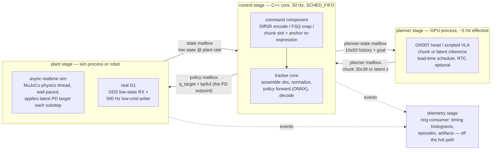
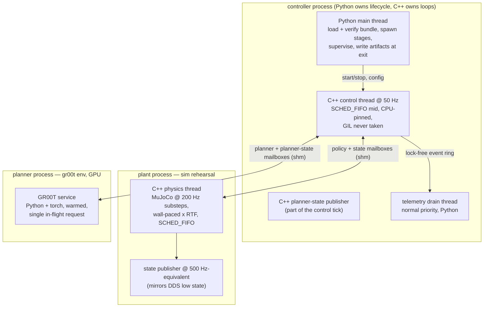

# Tracker runtime v2: asynchronous stage/mailbox architecture

Status: proposed specification, 2026-08-11. This page is the timeless spec.
History, run results, and incident notes stay in
[`embodied-control-tracker-runtime.md`](embodied-control-tracker-runtime.md),
which this page supersedes as the architecture reference.

## Charter

The runtime is a **deployment rehearsal rig**. It runs the exact thread
structure, mailbox communication, and timing behavior that the real robot
deployment runs, with a free-running simulator standing in for hardware.

Two consequences fix the runtime's scope:

1. **Synced, deterministic evaluation is out of scope.** IsaacLab-Imitation
   already owns lockstep evaluation and all paper metrics. The runtime never
   competes with it. The runtime measures what Isaac cannot: real
   asynchrony — jitter, staleness, deadline misses, mailbox ages — under the
   deployment thread structure.
2. **Asynchronous evaluation is statistical by design.** A free-running rig
   is not bit-reproducible. Its certificates are timing SLOs plus
   task-metric distributions over repeated episodes, never single-run
   numbers.

## The pipeline: stages and mailboxes

Three terms, defined before use:

- A **stage** is one thread (or process) running at its own rate.
- A **mailbox** is a single-writer single-reader, latest-wins, seqlock slot
  carrying one typed message plus a monotonic sequence and a receive stamp.
- The **plant** is the control-theory term for the physical system under
  control: whatever consumes PD setpoints and produces robot state. Here it
  is either the free-running MuJoCo simulator or the real G1 over DDS — the
  controller cannot tell them apart, and must not. It replaces v1's
  "eval-env backend", which wrongly suggested a gym-style object the
  controller steps in lockstep; a plant runs on its own clock.
Stages never call each other and never block on each other: every stage
reads the freshest input from its inbox mailboxes, computes, and writes its
outbox. Staleness is always observable (age = now − receive stamp on the
shared `CLOCK_MONOTONIC`), never hidden.

The four mailboxes, named once and used everywhere:

| mailbox | writer -> reader | payload | nominal rates |
| --- | --- | --- | --- |
| **state mailbox** | plant -> control | joint pos/vel, gravity, ang vel, anchor pose, stamp | write 500 Hz, read 50 Hz |
| **planner-state mailbox** | control -> planner | causal 10x93 history + goal id | write 50 Hz, read on request |
| **planner mailbox** | planner -> control | chunk [30x38] or latent command + provenance | write ~5 Hz, read 50 Hz |
| **policy mailbox** | control -> plant | q_target 29 + kp + kd + mode (CONTROL/DAMP) | write 50 Hz, read 500 Hz / per substep |

One mailbox implementation serves both deployments: the existing shm seqlock
slot (`ec_native`, measured 2.5 us publish+snapshot round trip) is the
cross-process form; the in-process form is the same layout without
`shm_open`. A single C++ `Mailbox` template with pybind bindings replaces
today's three ad-hoc paths (in-process Python buffer, ZMQ, shm). ZMQ remains
only at the EC orchestrator boundary, not on the control path.

## Threading model

Rules:

1. **Python owns lifecycle, C++ owns loops.** Python loads and verifies the
   bundle, resolves the job, spawns stages, and writes artifacts. No Python
   code executes on the 50 Hz or 200/500 Hz paths. Stage threads are created
   and joined in C++, set `SCHED_FIFO` + CPU affinity themselves, and export
   stats through a stats mailbox that Python samples at 1 Hz.
2. **One writer per mailbox, one reader per mailbox.** Fan-out needs a second
   mailbox, not a lock.
3. **Never block, never fabricate.** A stale input is consumed with its age
   recorded; past a per-mailbox age threshold the reader's watchdog fires.
   The policy-mailbox reader (plant) responds to staleness or a DAMP mode
   flag by damping (kp=0, kd=8). The control stage responds to state-mailbox
   staleness by writing DAMP into the policy mailbox. Deadline misses on the
   planner mailbox hold the previous command and restart its phase.
4. **In-process fallback for development.** The same stages can run as
   threads of one process (mailboxes in anonymous memory) for fast
   iteration and unit tests. The rehearsal configuration is cross-process.

## The async realtime sim (plant rehearsal)

The simulator behaves like the robot, not like a gym env:

- Its physics thread free-runs, wall-paced: each 5 ms substep is scheduled
  on the monotonic clock times a configurable real-time factor (RTF 1.0
  default; RTF > 1 as a stress test; RTF is the only concession to
  simulation).
- Each substep it reads the **policy mailbox** (latest wins — exactly what
  the firmware PD does at 500 Hz) and applies `q_target/kp/kd` through the
  bench-verified servo recipe. It never waits for a fresh setpoint.
- It publishes the **state mailbox** at the DDS-equivalent cadence with its
  own stamps.
- Fault injection is a first-class feature: configurable state-publication
  dropouts, added latency, and a hard pause (SIGSTOP-style) let the damp
  paths be drilled in sim before they are drilled on hardware.
- The controller cannot tell this plant from the real one: swapping
  sim -> robot changes which process is launched, nothing else. That swap is
  the whole point of the rehearsal rig.

Determinism note: this stage is intentionally not deterministic. When a
question needs determinism, it belongs in IsaacLab-Imitation.

## Compute placement (the C++ / Python line)

| component | language | why |
| --- | --- | --- |
| mailboxes (all four + stats/event ring) | C++ | lock-free, us-scale, shared across processes |
| control tick: obs assembly, normalizer, FSQ snap, chunk decode, action decode | C++ | on the 50 Hz hard path |
| policy + encoder forward | C++ via ONNX Runtime | on the hard path; bundle already ships ONNX |
| plant: physics thread, PD apply, state publisher | C++ (MuJoCo C API / unitree_sdk2) | 200-500 Hz, GIL-free, RT priority |
| DDS writer + low-state RX (hardware) | C++ | 500 Hz, safety-critical |
| timing instrumentation, watchdogs | C++ | must not perturb what they measure |
| GR00T / VLA service | Python + torch (GPU) | 60 ms scale; GPU stack; not a hard-RT path |
| bundle load + verification, job schema, supervision, artifacts, metrics aggregation | Python | cold path, changes often, benefits from pydantic |
| **reference semantics + tests** | **Python** | see below |

**Single source of truth.** The Python implementations (tracker, decoders,
publishers, maths) are demoted from "the runtime" to **the executable
specification**: slow, obvious, unit-tested. The C++ core is the deployment
implementation and must pass, forever: (a) the bundle golden traces, (b) a
parametrized parity suite that runs every semantic test against both
implementations, (c) property tests on the mailbox invariants. A C++ change
without a green parity suite is a defect by definition. This resolves the
two-implementations risk: one spec, one optimized replica, mechanical
equivalence.

## Timing SLOs (the certificate of this architecture)

Async runs are certified against service-level objectives, measured by the
C++ instrumentation and reported as histograms in `metrics.json`:

| quantity | target | notes |
| --- | --- | --- |
| control tick wake jitter | p99 < 200 us | SCHED_FIFO + pinning |
| control tick compute | p99 < 2 ms | assemble + forward + decode + publishes |
| policy-mailbox age at plant read | p99 < 22 ms | one control period + jitter margin |
| state-mailbox age at control read | p99 < 4 ms | one plant publication period + margin |
| planner-mailbox deadline misses | 0 at spec'd lead | lead must exceed measured inference ticks |
| plant substep wake jitter (sim) | p99 < 500 us | wall-paced RTF 1.0 |

Targets are initial engineering budgets, to be replaced by measured
baselines after R1; regressions against the recorded baseline fail the
certificate. Behavioral evaluation on top of a passing timing certificate:
selected-ten x >= 3 repeats, distributions reported, protocol-labeled
preliminary until repeats support the difference.

## Migration map (nothing is thrown away)

| exists today | becomes |
| --- | --- |
| `ec_native` shm seqlock slot | the `Mailbox` implementation (typed x4) |
| Codex's `native_tracker_core` + `onnx_engine` | the control-stage core, gated by the parity suite |
| Codex's `native_backend` (C++ MuJoCo) | the plant stage: add wall pacing, substep PD reads, state publication, fault injection |
| Codex's `unitree_backend` | the hardware plant, unchanged charter (M-HW) |
| Python tracker / decoders / publishers / maths | the executable spec + parity oracle |
| `AsyncChunkPullClient` | the planner stage's schedule (lead/miss semantics unchanged), transported over the planner mailboxes |
| GR00T stdio service | the planner stage service, stdio replaced by the two planner mailboxes |
| Python `ControlLoop` / runner / artifacts | supervision + artifact layer around the C++ stages |
| ZMQ command buffer | EC orchestrator boundary only; off the control path |

## Phases

- **R0 — foundations.** Commit the existing work as reviewable history in
  both repos. Unify the mailbox (C++ template, in-process + shm, bindings,
  property tests). Restore the exporter test coverage (ONNX gate split).
  Event ring + timing instrumentation. This page adopted as the spec.
- **R1 — async-in-one-process.** C++ control stage certified by the parity
  suite and golden traces; plant stage with wall pacing and substep PD
  reads; all four mailboxes in anonymous memory; first timing-SLO
  certificate; fault-injection drills in sim.
- **R2 — full rehearsal.** Three processes over shm mailboxes; GR00T service
  on the planner mailboxes; statistical behavioral evaluation
  (selected-ten x 3+); async certificate v2 supersedes D1-lite. RTC
  re-evaluated here once the retargeted head exists — planner-side science
  proceeds in parallel and is not blocked by R1.
- **R3 — hardware swap.** Plant process = `unitree_backend`. Its own safety
  review, jitter bench on the robot host, damp drills before any standing
  test. No other stage changes.

## Non-goals

Synced/lockstep sim evaluation (IsaacLab-Imitation owns it). Paper metrics
from this rig (deployment signal only). Multi-robot fan-out, bridge
networks, and message brokers on the control path. TensorRT until an ONNX
Runtime measurement misses a budget above.
